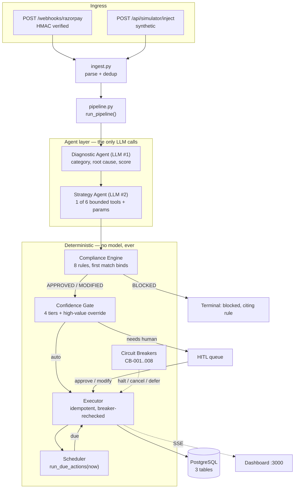

<div align="center">

# PayRecover — Architecture

**How the system is built, and why it is built that way.**

*Companion to the [README](README.md). The README explains what PayRecover does; this document
explains the engineering decisions underneath it, including the ones that were reversed.*

</div>

---

## Contents

- [The governing idea](#the-governing-idea)
- [System shape](#system-shape)
- [One pipeline, two doors](#one-pipeline-two-doors)
- [Stage 1–2: the agent layer](#stage-12-the-agent-layer)
- [Stage 3: the compliance engine](#stage-3-the-compliance-engine)
- [Stage 4: the confidence gate](#stage-4-the-confidence-gate)
- [Stage 5: the executor](#stage-5-the-executor)
- [Stage 6: scheduling and circuit breakers](#stage-6-scheduling-and-circuit-breakers)
- [The timezone convention](#the-timezone-convention)
- [Data model](#data-model)
- [The real-time layer](#the-real-time-layer)
- [The frontend](#the-frontend)
- [Determinism, and why the demo is reproducible](#determinism-and-why-the-demo-is-reproducible)
- [Testing strategy](#testing-strategy)
- [Bugs worth recording](#bugs-worth-recording)
- [What we would do differently at scale](#what-we-would-do-differently-at-scale)

---

## The governing idea

Payment recovery is two different problems wearing one coat.

The first is **judgement**: why did this payment fail, is it worth chasing, and what is the best way
to chase it? That is genuinely ambiguous, context-dependent, and benefits enormously from a language
model.

The second is **rules**: am I legally allowed to do this? NPCI caps retries at three per order. TRAI
forbids commercial messaging outside 09:00–20:00. The DND registry forbids SMS to registered numbers
entirely. An active dispute freezes everything. These are not ambiguous. They are `if` statements.

Most "AI agent" designs collapse both into one prompt and ask the model to be careful. PayRecover
splits them, and the split is the architecture:

> **LLMs propose. Deterministic code disposes.**

Two LLM calls happen per event, and then the model is out of the loop entirely. Compliance,
confidence gating, execution, scheduling and circuit breaking are all pure Python. A model can
suggest an action that violates NPCI; it cannot *perform* one, because the thing that performs
actions does not ask the model for permission.

This costs some flexibility. It buys three things worth more: a hallucinated `APPROVED` is
structurally impossible, every decision cites a `rule_id` that can be traced to a regulation, and
the identical decision comes out in mock mode and live mode — which is why the whole system runs
with no API keys at all.

---

## System shape



The asymmetry is deliberate. The agent layer is two boxes; the deterministic layer is five. In a
system that moves real money under regulation, that ratio is the point.

### Module map

| Module | Responsibility |
| ------ | -------------- |
| `app/main.py` | FastAPI app, CORS, lifespan (scheduler start/stop), 6 routers, 27 endpoints |
| `app/ingest.py` | Parse a Razorpay entity or a synthetic one into a `RecoveryEvent`; idempotent dedup |
| `app/pipeline.py` | `run_pipeline()` — everything *after* ingestion, shared by both doors |
| `app/diagnosis/` | `classifier.py` (taxonomy, recoverability, timing) + `enricher.py` (context) |
| `app/strategy/planner.py` | The deterministic strategy brain / ground-truth policy |
| `app/agent/` | The two orchestrators, the 6 tools, the prompts, the confidence gate |
| `app/compliance/engine.py` | The 8 rules. Pure function, no I/O, no model |
| `app/execution/` | `executor.py`, `circuit_breakers.py`, `scheduler.py`, `statuses.py` |
| `app/analytics.py` | ROI and the manual-recovery comparison, as pure functions |
| `app/chaos.py` | The 6 demo presets, as declarative data |
| `app/timeutil.py` | The single place that decides what a naive datetime meant |
| `app/llm/client.py` | Key-optional Groq wrapper with deterministic fallback |
| `app/razorpay/client.py` | Key-optional Razorpay wrapper |
| `app/sse.py` | Server-Sent Events fan-out |

---

## One pipeline, two doors

A real `payment.failed` webhook and a simulated `/inject` both ingest, then hand to the *same*
`run_pipeline()`. This was not the original design, and the story of why it changed is instructive.

Originally the webhook route ingested, dedupped, broadcast an SSE frame, and returned. The agent
stages were reachable only from `/inject`. Everything worked, every test passed — and the
architecture diagram in the README was describing an aspiration rather than the code. A real
Razorpay webhook would have been *recorded* and never *recovered*.

The fix was to extract `pipeline.py` and point both entry points at it. It deliberately begins
*after* ingestion, because ingestion is the one part that legitimately differs: the simulator invents
an entity, while the webhook verifies an HMAC signature and must survive redeliveries. Everything
downstream must not differ, or the demo stops being evidence of what production does.

Three decisions inside that seam are load-bearing:

**The pipeline runs inline and returns its result in the response.** A single `curl` against the
webhook returns the entire reasoning chain, which is what makes the system demonstrable. With live
LLM keys that costs a couple of seconds of webhook latency. Production would ack immediately and hand
to a queue; for a system whose thesis is legibility, showing the chain is worth more than the
milliseconds.

**A real webhook auto-executes, identically to `/inject`.** Same gate, same thresholds. It would have
been easy to make live traffic more timid than simulated traffic, but then the simulator would prove
nothing about production behaviour. The gate is the only thing deciding what fires without a human,
and `execute=True` cannot talk past `pending_review`, `escalated` or `blocked`.

**A redelivery is ingested but never re-decided.** Razorpay retries until it receives a 2xx.
Ingestion was already idempotent, but re-running the pipeline would mint a *second* payment link for
one failure. Redeliveries return `pipeline: {ran: false, reason: "duplicate_delivery"}`.

Relatedly: **a pipeline exception still acks 200.** The ingested failure is the part that cannot be
lost — Razorpay will not mention that payment again — and since a redelivery would skip the pipeline
anyway, a non-2xx buys nothing and risks a retry loop. The error is logged and reported in the
response body instead.

---

## Stage 1–2: the agent layer

### Diagnostic Agent (LLM #1)

Takes the raw failure plus enriched context and returns a `category` (`soft` / `hard` / `terminal`),
a human-readable label, a root-cause analysis, and a 0–100 recoverability score.

The enrichment is what makes the diagnosis useful: synthetic-but-stable customer history, issuer-bank
status, and the IST clock. "Stable" matters — history is derived from `sha256(customer identity)`, so
the same customer always has the same history, which makes the whole pipeline reproducible without a
real customer database.

### Strategy Agent (LLM #2)

Given the diagnosis, selects **exactly one** of six bounded tools and parameterises it. In live mode
this uses Groq's tool-calling with `tool_choice="required"`; the action space is a fixed schema, so
the model cannot invent an action outside it.

One detail is important: **confidence always comes from the deterministic planner, even in live
mode.** The model does not get to report its own confidence, because a model that wants to act can
simply assert it is 99% sure and walk through the gate. The planner computes confidence from the
diagnosis, the customer history and the attempt count; the model's role is selecting the tool, not
grading itself.

### Key-optional, by construction

`llm/client.py` mirrors the Razorpay wrapper. The `groq` SDK is imported **only** inside the live
branch, so a missing dependency is not an import error. `complete_json(..., fallback=)` drops to a
deterministic function on no-key *or any live error*, and returns `(result, source)` where `source`
is `"llm"` or `"mock"` — tagged all the way out to the API response and the SSE frame, so the origin
of every decision is auditable rather than assumed.

Since phase 5c the fallback also logs with a traceback. A wrong API key used to look exactly like a
routing decision, which is a bad failure mode to discover on stage.

**Model choice:** `openai/gpt-oss-120b` on Groq's free tier. The original `llama-3.3-70b-versatile`
was decommissioned mid-build and every call 404'd, so the model is now configurable via `GROQ_MODEL`
rather than hardcoded. The gpt-oss family are reasoning models, so `max_tokens` is 1024 and
`reasoning_effort="low"` is passed — guarded to `openai/gpt-oss*` so other models never receive an
unsupported kwarg. Free-tier limits are 30 req/min and 8K tokens/min; each event costs two calls, so
single injects run live and large batches gracefully degrade to mock. That degradation is a feature,
not an outage.

---

## Stage 3: the compliance engine

A pure function. No I/O, no database, no model, no clock except the one passed in:

```python
check_compliance(action, event, now) -> ComplianceResult(
    decision,        # APPROVED | MODIFIED | BLOCKED
    rule_id,         # "NPCI-001", "TRAI-001", ...
    rule_name,
    modification,    # the corrected params, when MODIFIED
    reason,
)
```

Eight rules, evaluated in priority order; **the first rule to fire is the binding decision.** Five
block, three modify. The full table lives in the [README](README.md#the-8-compliance-rules).

Three properties follow from it being pure:

- **Testable exhaustively.** All 8 rules are unit-tested by calling the function with hand-built
  inputs. No database, no event loop, no fixtures.
- **Identical in mock and live mode.** Compliance never depended on the model, so removing the API
  key changes nothing about what is permitted.
- **Replayable.** Given the same action and the same instant, the verdict is the same forever, which
  is what makes the audit trail an actual audit trail rather than a log.

`MODIFIED` deserves emphasis, because it is the difference between a compliance engine and a
validator. A validator says no. This engine mostly says *"not like that, like this"* — a retry
scheduled in NPCI peak hours is shifted out of them, an SMS to a DND-registered customer becomes an
email, a notification due at 22:00 is queued for 09:00. Recovery still happens; it happens legally.
Refusing would silently forfeit recoverable revenue, which is the failure mode nobody notices.

---

## Stage 4: the confidence gate

| Confidence | Route | Who acts |
| ---------- | ----- | -------- |
| 85–100 | `auto_execute` | System, immediately |
| 70–84 | `auto_execute_flagged` | System, flagged for monitoring |
| 50–69 | `hitl_review` | Paused for a human |
| 0–49 | `escalate` | Handed to the merchant |

**The high-value override:** any order above ₹10,000 is pinned to `hitl_review` regardless of
confidence.

That override catches the `escalate` tier too, and that detail was a design fix rather than an
original intention. A flaky test surfaced it: a high-value insufficient-funds failure sometimes
escalated instead of routing to a human, depending on which synthetic history the random customer
drew. The tempting fix is to pin the test. The correct fix was to notice that "large orders always
get a human" and "large orders are sometimes auto-closed as escalated" are contradictory — a merchant
who is told a ₹25,000 recovery was auto-abandoned is no happier than one told it was auto-executed.
The override now catches any non-blocked routing.

HITL resolves three ways, and `modify` is deliberately not a bypass: the merchant's edits go back
through the compliance engine. A `BLOCKED` verdict returns 409 and marks the action blocked; where
the engine returns `MODIFIED`, its correction **overrides the merchant's edit**. A human asking to
SMS a DND-registered customer still gets email.

> Humans can veto the agent. Neither can veto the regulator.

---

## Stage 5: the executor

Approving an action and performing it are separate concerns, so the executor is a standalone service
at `POST /api/actions/{id}/execute`. The pipeline calls that same service, which means the demo runs
end-to-end in one request while the endpoint stays independently testable.

Three invariants make it safe to run unattended:

**Idempotent.** Keyed on the action's status. A second call on an action in a final state is a no-op
returning `{"executed": false, "reason": "already_final"}`. A retried HTTP request, a scheduler tick
racing a manual trigger, or a judge double-clicking a button cannot double-charge anyone.

**Re-checked at the last moment.** Compliance was evaluated when the action was *proposed*, possibly
a day earlier. The breakers run again against current state immediately before anything fires, and a
trip is reported as a non-execution citing the breaker rather than as an error. This is the invariant
that stops a retry going out on a payment that has since been paid or disputed.

**Deferred rather than dropped.** An action due outside the TRAI window is pushed to the next legal
slot with `deferred_to` and `deferred_reason`, never discarded.

Executing a `schedule_smart_retry` means *arranging* the retry, so it ends in status `scheduled`
rather than `completed`. The payment attempt happens when the slot arrives. Conflating the two would
make the audit trail claim work was finished when it had only been queued.

---

## Stage 6: scheduling and circuit breakers

### The scheduler

`run_due_actions(session, now, limit)` is a pure, clock-injectable core. The APScheduler
`AsyncIOScheduler` tick is a thin wrapper over it, and `POST /api/simulator/run-due-actions` exposes
the identical core to the demo.

That split pays off twice: tests exercise the core with an explicit clock instead of sleeping, and a
live demo can fast-forward to tomorrow's 07:00 retry on command. APScheduler is imported lazily — if
it is not installed, `start()` returns `False`, startup logs `scheduler=off (manual trigger only)`,
and everything else keeps working.

### The circuit breakers

Compliance vets actions *before* they are proposed. Breakers halt work already **in flight**, because
the world moves between deciding and acting. They run on every state-changing webhook and again
pre-flight. The full table is in the [README](README.md#the-8-circuit-breakers).

Two carry deliberate deviations from "just halt":

- **CB-005 cancels retries only.** Hitting the NPCI cap makes a case notification-only; it does not
  close it. Cancelling the notifications too would forfeit revenue the rules still permit.
- **CB-008 defers rather than halts.** A nudge that comes due at 21:00 is rescheduled for 09:00.

The payoff is the scenario every merchant fears: a retry is scheduled, a reminder is queued, and the
customer pays through some other channel. `payment.captured` arrives, CB-001 trips, the queue is
cancelled — nobody is chased for money they already paid.

---

## The timezone convention

This is the subtlest thing in the codebase and the easiest to break, so it is written down.

The project has **two legitimate conventions and they meet at the database.** The agent and
compliance layers think in **IST**: NPCI peak hours, the TRAI window and "retry tomorrow at 7" are
Indian wall-clock concepts. Persistence and scheduling think in **UTC**.

SQLite discards the offset on write and hands back a naive datetime. So mixing the two shifts every
schedule by 5.5 hours **invisibly** — the stored row looks entirely correct. The agent says 09:00 IST
and the scheduler reads 14:30 IST, and nothing raises.

`app/timeutil.py` is the single place that decides what a naive datetime meant:

| Helper | Use |
| ------ | --- |
| `IST` | The `Asia/Kolkata` zone object |
| `utcnow()` | Aware UTC now |
| `to_utc(dt, naive_is=utc)` | Normalise on the way into a datetime column |
| `to_utc_from_ist(dt)` | For anything arriving from the agent side |
| `parse_dt(s)` | Parse, deciding the offsetless case explicitly |

**The rule:** call `to_utc_from_ist()` on anything arriving from the agent side, and `to_utc()` on
every write to a datetime column. `to_utc` on an already-aware value is an exact no-op, which is what
made retrofitting it provably safe.

`test_retry_at_without_an_offset_is_read_as_ist_not_utc` pins the convention by asserting the exact
stored instant. In tests, never call `.astimezone()` directly on a DB-returned timestamp — it adopts
the *machine's* zone, so an assertion can pass only because the developer's laptop happens to be on
IST.

---

## Data model

Three tables, deliberately few.

**`recovery_events`** — one row per failed payment. Holds the Razorpay identifiers, the money
(`amount`, `recovered_amount`, `recovery_cost_paise`, all in paise), the customer, the diagnosis
(`failure_category`, `root_cause_analysis`, `recoverability_score`), the recovery state machine
(`recovery_status`, `recovery_attempts`), the breaker-relevant flags (`has_dispute`,
`customer_opted_out`, `subscription_cancelled`), and `cascade_group_id` which links a follow-up
failure to the original case.

**`recovery_actions`** — one row per agent decision, and this is where the audit trail actually
lives. `agent_name` distinguishes `diagnostic` from `strategy`, so the reasoning chain is
reconstructable by ordering an event's actions. Each row carries the tool and its params, the
model's reasoning, the `confidence_score` with its `risk_factors` and `uncertainty_factors`, the
full compliance verdict (`decision`, `rule_id`, `rule_name`, `reason`), the execution outcome, and
`cost_paise`.

**`circuit_breaker_events`** — one row per trip: which breaker, what triggered it, and how many
actions it cancelled.

Two conventions apply everywhere: **amounts are in paise** (integers, never floats — this is money),
and **every datetime column is written through `to_utc()`**.

The schema is portable between PostgreSQL and SQLite. That is not incidental: it means the full test
suite runs against a throwaway SQLite file with no services running, while production uses Postgres.
`JSONVar` and the `Uuid` column type are the two places that portability is handled explicitly.

---

## The real-time layer

`GET /api/stream` is a Server-Sent Events endpoint. Every pipeline stage broadcasts a frame, so a
client can render the agent *thinking* rather than only its conclusion:

`connected` · `failure_detected` · `failure_duplicate` · `event_diagnosed` · `strategy_selected` ·
`compliance_checked` · `gate_decided` · `action_executed` · `retry_scheduled` · `action_deferred` ·
`action_failed` · `retry_fired` · `circuit_event` · `circuit_breaker` · `hitl_resolved`

SSE rather than WebSockets because the traffic is entirely one-directional — the server narrates, the
client listens, and every client command is already a normal HTTP call. A WebSocket would add
reconnection semantics and a second protocol for no gain.

**Known limitation, handled client-side:** the stream has no replay. There is no `id:` field and no
`Last-Event-ID` support, so frames emitted while a client is disconnected are gone permanently. The
dashboard compensates by re-fetching metrics, events and the HITL queue on every reconnect. Adding
replay would mean persisting a frame log and a cursor — worth it in production, not worth it for a
system where the database is already the durable record and the stream is a view onto it.

---

## The frontend

A Next.js 15 / React 19 dashboard, deliberately dependency-light: no state library, no icon library,
no component kit. One charting dependency (Recharts) for a single failure-mix pie; the agent trace,
the compliance band and the economics table are hand-built, because a generic chart would say less.

**One stream, one reducer, three surfaces.** `layout.tsx` holds a single `<StreamProvider>` owning one
`EventSource`. Frames pass through one reducer into one store shape, and the trace, feed and metrics
all read from it. No component opens its own connection.

**The adapter boundary is the important architectural choice.** The backend is honest but not
uniform, and the frontend must not spread that unevenness across twelve components. `lib/adapters.ts`
is the one place allowed to know about it:

1. **Datetimes vary by database.** Values serialize *with* `+00:00` on Postgres and *without* an
   offset on SQLite, and JavaScript parses an offsetless string as **local** time — so the same row
   renders 5.5 hours off depending on which database booted. One `parseInstant()` appends `Z` when no
   offset is present, and nothing else may call `new Date()` on a server string.
2. **`action_executed` names the tool `action`**; every other frame calls it `action_type`.
3. **Compliance info arrives in four shapes and actions in three**, because the dashboard, action and
   audit serializers each evolved for their own endpoint. Each collapses to one client type.
4. **`total` means different things** — the full match count on some endpoints, the page length on
   others.

Components see one clean type and never a raw response. `lib/types.ts` is written from *observed*
responses rather than assumed ones.

**Design direction:** the PRD's 35/65 split is rendered as a material change rather than a width
change. Left is a dark console (the machine: controls, hero metrics, presets, economics); right is a
light ledger (the record: trace, feed, timeline, audit). The product's thesis is *an autonomous
machine that produces an auditable record*, and making that seam visible is the most on-brief
structural move available.

The PRD mandates five semantic state colours, so those five are the **only** chroma in the product —
everything else is neutral. Type is IBM Plex Sans and IBM Plex Mono, self-hosted via `next/font` so
the container works offline. Plex Mono's tabular figures are a functional requirement: the ₹ counter
animates from zero and would visibly jitter as digit widths changed.

**The signature element is the IST compliance band** — a 24-hour strip with the TRAI window and NPCI
peak hours shaded and every scheduled action plotted as a tick, deferrals animating to the window
edge when CB-008 fires. The one thing PayRecover does that no other payments dashboard does is
*reason about time*; the band makes that watchable instead of buried in JSON.

---

## Determinism, and why the demo is reproducible

The mock enricher derives a customer's synthetic history from `sha256(identity)`, and `/inject`
invents a random customer. So confidence legitimately varies per injection, and a naive demo can take
a different branch each time it runs.

Rather than hide that, the system pins it. Exactly two combinations are provably deterministic across
all 64 possible synthetic histories:

| Combination | Always routes to |
| ----------- | ---------------- |
| `bank_downtime` under ₹10,000 | approved + `schedule_smart_retry` |
| anything above ₹10,000 | `hitl_review` + `generate_payment_link` |

Every demo step and every routing-dependent test uses one of those two. Presets that only want volume
leave the amount random, because volume does not need a pinned outcome.

The cascade preset needs a third kind of determinism: it promises a *specific confidence*. It pins
the customer identity — "Neha Chopra", a 98%-success history — which lands the insufficient-funds
pivot at confidence exactly 70 at any hour of any day. A guard test sweeps the hour and day
boundaries and fails loudly if the enricher formula ever moves that identity out of the auto band.

---

## Testing strategy

142 tests, all green, running offline against SQLite in mock mode.

| File | Tests | Covers |
| ---- | ----- | ------ |
| `test_execution.py` | 54 | Executor, breakers, scheduler, HITL, audit, export |
| `test_strategy.py` | 26 | Planner, all 8 compliance rules, gate tiers |
| `test_demo_slice.py` | 20 | Presets, batch runner, the cascade journey |
| `test_analytics.py` | 15 | ROI degenerate cases, economics, comparison |
| `test_diagnosis.py` | 12 | Classifier taxonomy, enrichment, inject path |
| `test_webhook.py` | 9 | HMAC, dedup, pipeline handoff, redelivery |
| `test_foundation.py` | 6 | App, health, DB, SSE |

No `parametrize` anywhere, so collected count equals top-level test functions — if `pytest -q`
reports anything but 142, a file failed to import, and that is worth checking before reading the
failures.

Three techniques were worth more than the count suggests.

**Sabotage the code to test the tests.** A passing suite proves nothing about whether it *could*
fail. After the analytics tests went green, three deliberate bugs were injected into
`app/analytics.py`. Two were caught. The third — dropping `and recovered_paise > 0` from the
zero-cost callout — passed all 15, because every free channel in the fixture had also recovered
money. A real coverage gap, found by attacking the tests rather than the code, and fixed by adding
the one fixture shape that distinguishes "recovered money at zero cost" from "cost nothing because
nothing happened".

**Design flakes out rather than discovering them.** Two were avoided by construction: asserting an
exact count of fired scheduled actions after a fast-forward would depend on the hour the suite runs,
and the weighted amount generator clears ₹10,000 about 12% of the time, so "exactly 2 require a
human" in a mixed batch would fail roughly one run in three.

**Know what the sandbox cannot see.** Much of this project was built in an environment with no
network, so no `pip install`, no `npm install`, no browser. `compileall` and pure-logic harnesses run
there; a type mismatch that only surfaces inside the database driver does not. The highest-value
static gate turned out to be neither of those: it was an **AST cross-check of every response key the
tests read against every key the code produces**, which catches the most likely remaining failure
mode — a key name drifting between handler and test.

---

## Bugs worth recording

Four of these were found by auditing documentation against code, which is a technique more than an
anecdote: writing down what the system does forces a check of whether it does it.

**The TRAI bypass.** `scheduler.py` passed `ignore_defer=True` when handing a deferred notification
back to the executor, so a late tick — a server down overnight, or a fast-forwarded clock — would
send a 09:00 message at 22:00. Removed; the window is re-checked against `now`. This cannot loop,
because a deferral always targets the *start* of a legal window.

**CB-008 misattribution.** An action that was merely not-yet-due was logged with a CB-008 reason,
putting a compliance trip in the audit trail that never happened. The two deferral causes now carry
distinct reasons.

**The 5.5-hour scheduling skew.** Described in [the timezone convention](#the-timezone-convention).
The agent said 09:00 IST, the scheduler read 14:30 IST, and the stored row looked correct.

**The webhook that never reached the agent.** A product gap rather than a bug — fixed by extracting
`pipeline.py`. See [one pipeline, two doors](#one-pipeline-two-doors).

**The string/UUID seam.** `recover_event` returns `action_id` as a string, and it must: it goes out
over HTTP responses and SSE frames, neither of which can carry a `uuid.UUID`. But SQLAlchemy's `Uuid`
column type calls `value.hex` on whatever it receives, so passing that string to `session.get()`
raised `AttributeError: 'str' object has no attribute 'hex'`. One line caused 11 of 103 test
failures. Fixed by coercing at the single boundary and returning `None` — a 404, not a 500 — on a
malformed id. The two other routers were never broken only because FastAPI coerces their path
params automatically, which hid the pattern.

**The silently truncated export.** `/api/audit/export` defaulted to `limit=500` and the dashboard
never passed one, so past 500 rows the downloaded file quietly contained fewer entries than the
drawer claimed. The export now returns the whole filtered chain by default. In the same pass, the
drawer's plain `<a href>` to a cross-origin endpoint was replaced with a Blob fetch — any failure had
previously navigated the entire dashboard to a raw error page.

**Recovered cash multiplied by attempts.** When several failure rows share an order — which is
exactly what the cascade journey creates — a capture was crediting the recovered amount to every row.
`apply_circuit_event` now assigns it to the oldest row only and resolves the rest at zero.

---

## What we would do differently at scale

Stated plainly, because a system that cannot describe its own limits is not finished being designed.

**The pipeline would be a queue.** Running inline and returning the reasoning chain in the response
is the right call for a demonstrable system and the wrong one for throughput. Production would ack
the webhook immediately and hand to a worker; the pipeline is already a single function with no
request context, so this is a change of caller, not of design.

**SSE would carry replay.** An `id:` per frame and `Last-Event-ID` support, backed by a short frame
log, would remove the client's re-fetch-on-reconnect workaround.

**Customer history would be real.** The synthetic-history enricher exists because there is no
merchant CRM to query. In production it becomes a lookup, and the determinism guarantees the demo
relies on would be replaced by proper fixtures.

**Breaker checks would be a database constraint too.** They currently run pre-flight in application
code, which is correct but racy under concurrency. A partial unique index on "one active action per
event per type" would make the guarantee structural.

---

<div align="center">

*For the user-facing tour, see the [README](README.md).*

</div>
