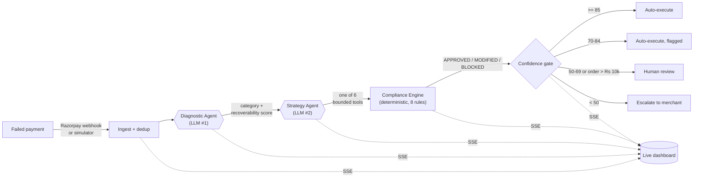

<div align="center">

# PayRecover

**Autonomous AI payment-recovery agent for Indian merchants.**

Detects failed Razorpay payments, diagnoses the root cause with an LLM, picks a bounded recovery strategy with a confidence score, and enforces regulatory compliance through **deterministic code** — never a model. Full audit trail, real-time event stream, human-in-the-loop for the calls that matter.

*Built for the Razorpay AI Buildathon — Track 03: AI Revenue Recovery.*


</div>

---

## Table of contents

- [Why PayRecover](#why-payrecover)
- [The core idea: compliance is code](#the-core-idea-compliance-is-code)
- [Architecture](#architecture)
- [The recovery pipeline](#the-recovery-pipeline)
- [Runs with zero credentials](#runs-with-zero-credentials)
- [Tech stack](#tech-stack)
- [Quick start](#quick-start)
- [Configuration](#configuration)
- [Getting the API keys](#getting-the-api-keys)
- [API reference](#api-reference)
- [The 6 recovery tools](#the-6-recovery-tools)
- [The 8 compliance rules](#the-8-compliance-rules)
- [The confidence gate (HITL)](#the-confidence-gate-hitl)
- [Testing](#testing)
- [Project structure](#project-structure)
- [Roadmap](#roadmap)

---

## Why PayRecover

A meaningful share of Indian digital payments fail on the first attempt — insufficient funds, bank downtime, expired cards, OTP drop-offs, gateway timeouts. Most of that revenue is recoverable, but recovering it by hand is slow, and recovering it with a naive script is reckless: retry too often and you breach NPCI limits; message at the wrong hour and you breach TRAI rules; nudge a customer on the DND registry and you breach that too.

PayRecover automates the *judgement* (diagnose the failure, choose a strategy) with LLMs, while automating the *rules* (what you are legally allowed to do) with deterministic code. Every failed payment flows through the same auditable pipeline, and anything the system isn't confident about — or any order large enough to matter — is routed to a human instead of being executed silently.

---

## The core idea: compliance is code

This is the design decision the whole project is built around.

An LLM asked to "check if this action is compliant" can hallucinate an `APPROVED` where it should have said `BLOCKED`. That is unacceptable when the downstream action touches real money and real regulations. So in PayRecover the LLMs **never** decide compliance. They diagnose and propose; a pure-Python engine of `if/else` rules decides what is actually permitted.

The consequences:

- **Zero hallucination on the rules that matter.** NPCI retry caps, TRAI messaging windows, DND handling, dispute freezes, cost ceilings — all enforced by code that cannot make them up.
- **Auditable and reproducible.** Every decision returns the exact `rule_id` that fired (`NPCI-001`, `TRAI-001`, …) and is identical in mock and live modes.
- **Faster and cheaper.** No extra LLM round-trip and no token spend on rule checking.

Even the *confidence score* that drives the human-in-the-loop gate is computed deterministically — a model cannot talk its way past review by asserting it's 99% sure.

---

## Architecture



Two LLM calls per event (diagnose, then strategise); everything after that — compliance, confidence gating, persistence — is deterministic. Each stage broadcasts a Server-Sent Event so a dashboard can render the agent's reasoning live.

---

## The recovery pipeline

**Stage 1 — Diagnostic Agent (LLM #1).** Takes the raw failure plus enriched context (synthetic-but-stable customer history, issuer-bank status, IST clock) and returns a failure `category` (`SOFT` / `HARD` / `TERMINAL`), a human-readable label, a root-cause analysis, and a 0–100 recoverability score.

**Stage 2 — Strategy Agent (LLM #2).** Given the diagnosis, selects **exactly one** of six bounded tools (`tool_choice="required"`) and parameterises it — when to retry, what payment-link copy and expiry to use, which channel to notify on. The action space is fixed and validated; the model cannot invent an action.

**Stage 3 — Compliance Engine (deterministic).** Runs the proposed action through eight regulatory rules and returns `APPROVED`, `MODIFIED` (e.g. a retry shifted out of NPCI peak hours, or an SMS to a DND customer switched to email), or `BLOCKED` with the citing rule.

**Stage 4 — Confidence gate / HITL.** Routes the compliant action by confidence: high → auto-execute, moderate → auto-execute but flagged, low → pause for human review, very low → escalate. Any order above ₹10,000 is pinned to human review regardless of confidence.

> **Key-optional at every stage.** With no Groq key, stages 1–2 fall back to a deterministic "mock brain" that produces the exact same JSON shape, so the whole pipeline runs offline. Each result is tagged `"source": "llm"` or `"source": "mock"` so the origin is always auditable.

---

## Runs with zero credentials

Every external key is **optional**. With nothing configured, the backend runs in **simulation mode**: Razorpay calls return realistic mock responses, and the agent layer uses its deterministic fallback. You can develop, test, and demo the entire pipeline before wiring a single real key, then drop keys into `.env` to go live incrementally (Groq first, Razorpay when you want real payment links).

---

## Tech stack

| Layer      | Choice                                                        |
| ---------- | ------------------------------------------------------------- |
| Backend    | FastAPI (Python 3.11+), fully async                           |
| Database   | PostgreSQL 16 via SQLAlchemy 2 (async) + asyncpg; SQLite for local/tests |
| Real-time  | Server-Sent Events (SSE)                                      |
| LLM        | Groq API — `openai/gpt-oss-120b` (free tier), direct SDK, no LangChain |
| Payments   | Official `razorpay` SDK (test mode), key-optional             |
| Scheduling | APScheduler (execution phase)                                 |
| Frontend   | Next.js 15 + React 19 + Tailwind *(roadmap)*                  |
| Deploy     | Docker Compose                                                |

---

## Quick start

### Docker (recommended)

Boots PostgreSQL + the backend in simulation mode with one command:

```bash
docker compose up --build
```

- API root & health: <http://localhost:8000/> and <http://localhost:8000/health>
- Interactive API docs (Swagger): <http://localhost:8000/docs>

### Local (without Docker)

Requires Python 3.11+. A local PostgreSQL is optional — point at SQLite for a quick spin.

```bash
cd backend
python -m venv .venv
source .venv/bin/activate          # Windows: .\.venv\Scripts\Activate.ps1
pip install -r requirements.txt
cp .env.example .env               # optional; defaults work

# Option A — no Postgres handy? Use SQLite:
DATABASE_URL="sqlite+aiosqlite:///./payrecover.db" uvicorn app.main:app --reload --port 8000

# Option B — use the Postgres URL from .env:
uvicorn app.main:app --reload --port 8000
```

> On Windows PowerShell, set the SQLite override with `$env:DATABASE_URL="sqlite+aiosqlite:///./payrecover.db"` before the `uvicorn` line.

### See it work

```bash
# Inject a synthetic failure and run it through the full pipeline
# (diagnose + strategy + compliance + gate all run by default):
curl -X POST http://localhost:8000/api/simulator/inject \
  -H "Content-Type: application/json" \
  -d '{"failure_type": "insufficient_funds"}'

# Aggregate metrics (₹ recovered, recovery rate, breakdowns):
curl http://localhost:8000/api/dashboard/metrics

# Watch the live event stream (leave running, then inject in another terminal):
curl -N http://localhost:8000/api/stream
```

With a `GROQ_API_KEY` set, the injected event's `diagnosis_source` and `recovery.source` come back as `"llm"`; with no key they come back as `"mock"` — same shape either way.

---

## Configuration

Copy `backend/.env.example` to `backend/.env`. All keys are optional.

| Variable                  | Purpose                                                | If unset                              |
| ------------------------- | ------------------------------------------------------ | ------------------------------------- |
| `GROQ_API_KEY`            | Groq LLM key (`gsk_…`) for the two agents              | Agent layer uses the deterministic **mock brain** |
| `GROQ_MODEL`              | Groq chat model                                        | `openai/gpt-oss-120b`                 |
| `RAZORPAY_KEY_ID`         | Razorpay API key id (`rzp_test_…`)                     | Razorpay calls are **simulated**      |
| `RAZORPAY_KEY_SECRET`     | Razorpay API key secret                                | Razorpay calls are **simulated**      |
| `RAZORPAY_WEBHOOK_SECRET` | Verifies inbound webhook HMAC signatures               | Signature check **skipped** (dev)     |
| `DATABASE_URL`            | Async DB URL                                           | Local Postgres default                |
| `CORS_ORIGINS`            | Allowed origins (JSON array or comma-separated)        | `http://localhost:3000`               |
| `FORCE_SIMULATION`        | Force simulation even if keys are present              | `false`                               |

---

## Getting the API keys

### Groq (`GROQ_API_KEY`)

1. Sign in at <https://console.groq.com>.
2. Open **API Keys → Create API Key** and copy the value (`gsk_…`).
3. Put it into `backend/.env`.

The default model is `openai/gpt-oss-120b`, which is on Groq's **free plan** (30 req/min, 1,000 req/day, 8K tokens/min). The pipeline makes two LLM calls per event, so single injects and small batches run live; large batches gracefully fall back to the mock when the rate limit is hit. To switch models, set `GROQ_MODEL` (e.g. `openai/gpt-oss-20b` or `qwen/qwen3.6-27b`) — no code change needed.

### Razorpay test keys (`RAZORPAY_KEY_ID` + `RAZORPAY_KEY_SECRET`)

1. Create/log in at <https://dashboard.razorpay.com> and toggle to **Test Mode**.
2. Go to **Account & Settings → API Keys → Generate Test Key**.
3. Copy the **Key Id** (`rzp_test_…`) and the **Key Secret** (shown only once).
4. Put both into `backend/.env`.

### Razorpay webhook secret (`RAZORPAY_WEBHOOK_SECRET`)

1. In the dashboard (Test Mode): **Settings → Webhooks → Create New Webhook**.
2. **Webhook URL:** your backend's public URL ending in `/webhooks/razorpay`. For local dev, expose `localhost:8000` with a tunnel:
   ```bash
   cloudflared tunnel --url http://localhost:8000
   # then use https://<tunnel-domain>/webhooks/razorpay as the URL
   ```
3. **Secret:** enter any strong string — this exact value goes into `RAZORPAY_WEBHOOK_SECRET`.
4. **Active events:** at minimum `payment.failed` and `payment.captured` (also useful: `order.paid`, `payment.dispute.created`).
5. Save. Razorpay signs each delivery; the backend verifies it with your secret.

---

## API reference

| Method | Path                          | Description                                                        |
| ------ | ----------------------------- | ------------------------------------------------------------------ |
| GET    | `/` , `/health`               | Service status, Razorpay/Groq mode, live SSE connection count      |
| GET    | `/api/stream`                 | SSE stream of live recovery activity                               |
| POST   | `/webhooks/razorpay`          | Webhook receiver (HMAC verify, dedup, SSE broadcast)               |
| POST   | `/api/simulator/inject`       | Inject 1–200 synthetic failures and run the full agent pipeline    |
| GET    | `/api/simulator/profiles`     | List the available failure profiles                                |
| GET    | `/api/dashboard/metrics`      | ₹ recovered, recovery rate, status & failure breakdowns            |
| GET    | `/api/dashboard/events`       | Paginated recovery events (filter by `status`)                     |
| GET    | `/api/dashboard/events/{id}`  | Single event + its agent actions + circuit-breaker events          |

**`POST /api/simulator/inject`** accepts an optional JSON body:

```jsonc
{
  "failure_type": "insufficient_funds", // omit for a random weighted profile
  "amount": 1500000,                     // paise; omit for random
  "method": "card",                      // card | upi | netbanking | wallet
  "count": 1,                            // 1–200
  "diagnose": true,                      // run the Diagnostic Agent
  "recover": true                        // run Strategy + Compliance + gate
}
```

---

## The 6 recovery tools

The Strategy Agent must pick exactly one. This is the entire action space — nothing else can be chosen.

| Tool                          | When it's used                                                    | Cost      |
| ----------------------------- | ----------------------------------------------------------------- | --------- |
| `schedule_smart_retry`        | Soft failures (timeout, bank downtime); never after 3 retries     | Free      |
| `generate_payment_link`       | Hard failures needing customer action (insufficient funds, expired card) | Free |
| `send_recovery_notification`  | A recovery nudge via email or SMS (max 1 / 24h / customer)        | ~₹0.20 (SMS) |
| `offer_alternative_method`    | One method keeps failing but alternatives exist (card → UPI)      | Free      |
| `escalate_to_merchant`        | Terminal failures, edge cases, or when automation is inappropriate | Free     |
| `mark_unrecoverable`          | Terminal failures where no recovery is possible or advisable       | Free     |

Recovery is deliberately near-zero-cost — only an actual outbound SMS carries a real charge, which is what makes the ROI story hold and what the cost-ceiling rule polices.

---

## The 8 compliance rules

Enforced deterministically, in priority order. The first rule to fire is the binding decision.

| Rule ID      | Name                       | Decision   | What it enforces                                             |
| ------------ | -------------------------- | ---------- | ----------------------------------------------------------- |
| `DISP-001`   | Active Dispute             | `BLOCKED`  | An active dispute halts **all** recovery on that payment    |
| `WINDOW-001` | Max Recovery Window        | `BLOCKED`  | No recovery after 14 days from failure                      |
| `COST-001`   | Cost Ceiling               | `BLOCKED`  | Cumulative recovery cost may not exceed 15% of order value  |
| `NPCI-001`   | NPCI Retry Cap             | `BLOCKED`  | Max 3 retries per order                                     |
| `NPCI-002`   | NPCI Peak Hours            | `MODIFIED` | Retries shifted out of 10:00–13:00 and 17:00–21:30 IST      |
| `DND-001`    | DND Registry               | `MODIFIED` | SMS to a DND-registered customer is switched to email       |
| `TRAI-001`   | TRAI Notification Hours    | `MODIFIED` | Notifications only 09:00–20:00 IST; otherwise queued        |
| `FREQ-001`   | Notification Frequency Cap | `BLOCKED`  | Max 1 notification per 24h per customer                     |

All times are IST (`Asia/Kolkata`); all amounts are in paise.

---

## The confidence gate (HITL)

The compliant action is routed by a deterministically computed confidence score:

| Confidence | Route                   | Who acts                          |
| ---------- | ----------------------- | --------------------------------- |
| 85–100     | `auto_execute`          | System, immediately               |
| 70–84      | `auto_execute_flagged`  | System, but flagged for monitoring |
| 50–69      | `hitl_review`           | Paused for a human to approve     |
| 0–49       | `escalate`              | Handed to the merchant            |

**High-value override:** any order above **₹10,000** is pinned to `hitl_review` regardless of confidence — a large order is never auto-executed *nor* auto-escalated/closed without a human. The downside of an automated mistake on a large order isn't worth the saved click.

---

## Testing

```bash
cd backend
pip install -r requirements.txt   # includes pytest + pytest-asyncio
pytest                            # runs against a throwaway SQLite DB
```

**50 tests, all passing.** Coverage spans the webhook HMAC signature (valid/invalid), ingestion + idempotent dedup, `payment.captured` marking an event recovered, the diagnostic classifier across all failure profiles, the full diagnose→inject path, the strategy planner's tool selection, all 8 compliance rules, every confidence-gate tier plus the high-value override, and the full `recover=true` inject path.

Tests run in mock mode (no external keys), so they're fully offline and reproducible.

---

## Project structure

```
razorpay/
├── backend/
│   ├── app/
│   │   ├── main.py               # FastAPI app: CORS, lifespan, SSE, routers
│   │   ├── config.py             # settings (all keys optional)
│   │   ├── database.py           # async engine + session (Postgres / SQLite)
│   │   ├── models.py             # ORM: recovery_events, recovery_actions, circuit_breaker_events
│   │   ├── ingest.py             # shared ingestion + serialization service
│   │   ├── sse.py                # Server-Sent Events manager
│   │   ├── diagnosis/            # classifier.py + enricher.py (Diagnostic brain)
│   │   ├── strategy/             # planner.py (deterministic Strategy brain)
│   │   ├── compliance/           # engine.py (the 8 deterministic rules)
│   │   ├── agent/                # diagnostic_agent, strategy_agent, tools, confidence, prompts
│   │   ├── llm/client.py         # key-optional Groq wrapper (mock fallback)
│   │   ├── razorpay/client.py    # key-optional Razorpay wrapper
│   │   ├── webhooks/             # signature.py (HMAC) + router.py
│   │   └── api/                  # dashboard.py + simulator_routes.py
│   ├── tests/                    # pytest suite (SQLite)
│   ├── requirements.txt
│   ├── Dockerfile
│   └── .env.example
├── docker-compose.yml
└── README.md
```

---

## Roadmap

**Done — the decision pipeline (core system)**

- FastAPI foundation, key-optional config, async DB + 3-table schema
- Webhook receiver: HMAC verification, dedup, circuit-event handling
- Real-time SSE stream
- **Diagnostic Agent** (LLM #1): failure classification + recoverability scoring
- **Strategy Agent** (LLM #2): selects 1 of 6 bounded tools with confidence
- **Compliance Engine**: 8 deterministic NPCI / TRAI / DND / dispute / cost rules
- **Confidence gate + HITL** with the high-value override
- **Live Groq integration** on the free tier, with a deterministic mock fallback
- Failure simulator (`/inject`) + dashboard metrics/events endpoints
- Docker Compose + 50-test pytest suite

**In progress / next**

- **Execution engine**: actually call Razorpay Payment Links, schedule retries via APScheduler, flip approved actions to executed, and the HITL approve/reject flow
- **Circuit breakers** as a first-class engine (payment succeeded, dispute raised, customer opt-out, merchant pause, etc.)
- **Full simulator**: weighted chaos presets and cascade mode
- **Next.js dashboard**: dual-pane command center with live agent trace, recovery economics, and before/after views
- **ARCHITECTURE.md** + a scripted demo walkthrough
