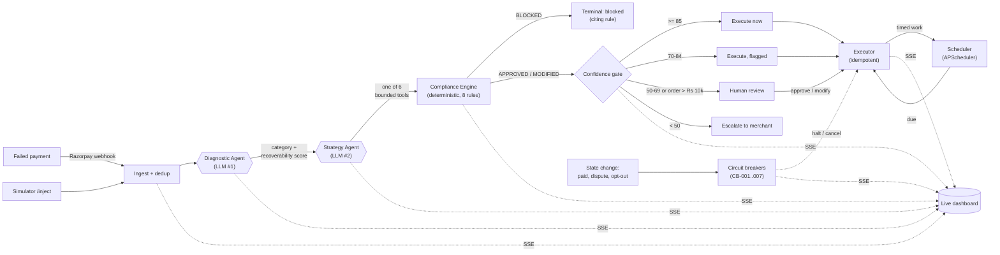

<div align="center">

# PayRecover

**Autonomous AI payment-recovery agent for Indian merchants.**

Detects failed Razorpay payments, diagnoses the root cause with an LLM, picks a bounded recovery strategy with a confidence score, and enforces regulatory compliance through **deterministic code** — never a model. Then it actually executes: schedules retries, mints payment links, sends notifications — and halts itself the instant a circuit breaker says stop. Full audit trail, real-time event stream, human-in-the-loop for the calls that matter.

*Built for the Razorpay AI Buildathon — Track 03: AI Revenue Recovery.*


</div>

---

## Table of contents

- [Why PayRecover](#why-payrecover)
- [The core idea: compliance is code](#the-core-idea-compliance-is-code)
- [Architecture](#architecture)
- [The recovery pipeline](#the-recovery-pipeline)
- [Runs with zero credentials](#runs-with-zero-credentials)
- [Tech stack](#tech-stack)
- [Quick start](#quick-start)
- [Configuration](#configuration)
- [Getting the API keys](#getting-the-api-keys)
- [API reference](#api-reference)
- [SSE frames](#sse-frames)
- [The 6 recovery tools](#the-6-recovery-tools)
- [The 8 compliance rules](#the-8-compliance-rules)
- [The confidence gate (HITL)](#the-confidence-gate-hitl)
- [Execution and scheduling](#execution-and-scheduling)
- [The 8 circuit breakers](#the-8-circuit-breakers)
- [The audit trail](#the-audit-trail)
- [Testing](#testing)
- [Project structure](#project-structure)
- [Roadmap](#roadmap)

---

## Why PayRecover

A meaningful share of Indian digital payments fail on the first attempt — insufficient funds, bank downtime, expired cards, OTP drop-offs, gateway timeouts. Most of that revenue is recoverable, but recovering it by hand is slow, and recovering it with a naive script is reckless: retry too often and you breach NPCI limits; message at the wrong hour and you breach TRAI rules; nudge a customer on the DND registry and you breach that too.

PayRecover automates the *judgement* (diagnose the failure, choose a strategy) with LLMs, while automating the *rules* (what you are legally allowed to do) with deterministic code. Every failed payment flows through the same auditable pipeline, and anything the system isn't confident about — or any order large enough to matter — is routed to a human instead of being executed silently.

---

## The core idea: compliance is code

This is the design decision the whole project is built around.

An LLM asked to "check if this action is compliant" can hallucinate an `APPROVED` where it should have said `BLOCKED`. That is unacceptable when the downstream action touches real money and real regulations. So in PayRecover the LLMs **never** decide compliance. They diagnose and propose; a pure-Python engine of `if/else` rules decides what is actually permitted.

The consequences:

- **Zero hallucination on the rules that matter.** NPCI retry caps, TRAI messaging windows, DND handling, dispute freezes, cost ceilings — all enforced by code that cannot make them up.
- **Auditable and reproducible.** Every decision returns the exact `rule_id` that fired (`NPCI-001`, `TRAI-001`, …) and is identical in mock and live modes.
- **Faster and cheaper.** No extra LLM round-trip and no token spend on rule checking.

Even the *confidence score* that drives the human-in-the-loop gate is computed deterministically — a model cannot talk its way past review by asserting it's 99% sure.

---

## Architecture



Two LLM calls per diagnosed event (diagnose, then strategise); everything after that — compliance, confidence gating, execution, breakers, persistence — is deterministic. Each stage broadcasts a Server-Sent Event so a dashboard can render the agent's reasoning live.

> **One pipeline, two doors.** A real `payment.failed` webhook and a simulated `/inject` both ingest through `ingest.py` and then hand off to the same orchestration in `pipeline.py` — so live traffic and demo traffic take one code path and are governed by the same confidence gate. The only difference is ingestion itself, which is where they legitimately differ: the simulator mints a synthetic entity, while the webhook verifies an HMAC signature and has to survive Razorpay's redeliveries. A redelivered webhook is ingested idempotently *and* never re-decided, so a retry can't mint a second payment link for one failure.

---

## The recovery pipeline

**Stage 1 — Diagnostic Agent (LLM #1).** Takes the raw failure plus enriched context (synthetic-but-stable customer history, issuer-bank status, IST clock) and returns a failure `category` (`soft` / `hard` / `terminal`), a human-readable label, a root-cause analysis, and a 0–100 recoverability score.

**Stage 2 — Strategy Agent (LLM #2).** Given the diagnosis, selects **exactly one** of six bounded tools (`tool_choice="required"`) and parameterises it — when to retry, what payment-link copy and expiry to use, which channel to notify on. The action space is fixed and validated; the model cannot invent an action.

**Stage 3 — Compliance Engine (deterministic).** Runs the proposed action through eight regulatory rules and returns `APPROVED`, `MODIFIED` (e.g. a retry shifted out of NPCI peak hours, or an SMS to a DND customer switched to email), or `BLOCKED` with the citing rule. A `BLOCKED` action never reaches the gate — it terminates there.

**Stage 4 — Confidence gate / HITL.** Routes the compliant action by confidence: high → auto-execute, moderate → auto-execute but flagged, low → pause for human review, very low → escalate. Any order above ₹10,000 is pinned to human review regardless of confidence.

**Stage 5 — Executor (deterministic).** Performs the approved action for real: mints a Razorpay Payment Link, arranges a retry order, sends a notification. Execution is **idempotent** — an action already in a final state returns `{"executed": false, "reason": "already_final"}` instead of firing twice — and every action is re-checked against the circuit breakers immediately before it fires, so work approved a day ago cannot go out on a payment that has since been paid or disputed.

**Stage 6 — Scheduler + circuit breakers.** Timed work (a retry scheduled for 07:00 tomorrow, a notification deferred out of the TRAI quiet hours) is fired by an in-process APScheduler tick over a deterministic `run_due_actions(now)` core. Meanwhile the circuit breakers watch for the reasons recovery should stop mid-flight — the customer paid, a dispute landed, they opted out — and cancel the pending queue.

> **Key-optional at every stage.** With no Groq key, stages 1–2 fall back to a deterministic "mock brain" that produces the exact same JSON shape, so the whole pipeline runs offline. Each result is tagged `"source": "llm"` or `"source": "mock"` so the origin is always auditable.

---

## Runs with zero credentials

Every external key is **optional**. With nothing configured, the backend runs in **simulation mode**: Razorpay calls return realistic mock responses, and the agent layer uses its deterministic fallback. You can develop, test, and demo the entire pipeline before wiring a single real key, then drop keys into `.env` to go live incrementally (Groq first, Razorpay when you want real payment links).

---

## Tech stack

| Layer      | Choice                                                        |
| ---------- | ------------------------------------------------------------- |
| Backend    | FastAPI (Python 3.11+), fully async                           |
| Database   | PostgreSQL 16 via SQLAlchemy 2 (async) + asyncpg; SQLite for local/tests |
| Real-time  | Server-Sent Events (SSE)                                      |
| LLM        | Groq API — `openai/gpt-oss-120b` (free tier), direct SDK, no LangChain |
| Payments   | Official `razorpay` SDK (test mode), key-optional             |
| Scheduling | APScheduler, in-process and optional — a missing install degrades to manual firing |
| Frontend   | Next.js 15 + React 19 + Tailwind *(roadmap)*                  |
| Deploy     | Docker Compose                                                |

---

## Quick start

### Docker (recommended)

Boots PostgreSQL + the backend in simulation mode with one command:

```bash
docker compose up --build
```

- API root & health: <http://localhost:8000/> and <http://localhost:8000/health>
- Interactive API docs (Swagger): <http://localhost:8000/docs>

### Local (without Docker)

Requires Python 3.11+. A local PostgreSQL is optional — point at SQLite for a quick spin.

```bash
cd backend
python -m venv .venv
source .venv/bin/activate          # Windows: .\.venv\Scripts\Activate.ps1
pip install -r requirements.txt
cp .env.example .env               # optional; defaults work

# Option A — no Postgres handy? Use SQLite:
DATABASE_URL="sqlite+aiosqlite:///./payrecover.db" uvicorn app.main:app --reload --port 8000

# Option B — use the Postgres URL from .env:
uvicorn app.main:app --reload --port 8000
```

> On Windows PowerShell, set the SQLite override with `$env:DATABASE_URL="sqlite+aiosqlite:///./payrecover.db"` before the `uvicorn` line.

### See it work

```bash
# 1. Inject a synthetic failure and run it through the full pipeline.
#    diagnose + strategy + compliance + gate + execution all run by default:
curl -X POST http://localhost:8000/api/simulator/inject \
  -H "Content-Type: application/json" \
  -d '{"failure_type": "bank_downtime", "amount": 250000}'
#    -> events[0].recovery.status = "approved", .executed = true
#       events[0].execution.result.retry_order_id = the retry the agent arranged

# 2. A big order is never auto-executed — it lands in the human queue instead:
curl -X POST http://localhost:8000/api/simulator/inject \
  -H "Content-Type: application/json" \
  -d '{"failure_type": "insufficient_funds", "amount": 1500000}'
curl http://localhost:8000/api/hitl/pending
curl -X POST http://localhost:8000/api/hitl/<action_id>/approve

# 3. Fast-forward the clock so scheduled work fires now instead of at 07:00:
curl -X POST http://localhost:8000/api/simulator/run-due-actions \
  -H "Content-Type: application/json" \
  -d '{"now": "2030-01-01T12:00:00+05:30"}'

# 4. The customer pays. CB-001 trips and cancels everything still pending:
curl -X POST http://localhost:8000/api/simulator/circuit-event \
  -H "Content-Type: application/json" \
  -d '{"event_type": "payment.captured", "order_id": "<order_sim_...>"}'
#    -> breakers_tripped: [{"breaker_id": "CB-001", ...}]

# 5. Read the reasoning chain back, or export it:
curl http://localhost:8000/api/audit/log
curl http://localhost:8000/api/audit/breakers
curl "http://localhost:8000/api/audit/export?format=csv" -o audit.csv

# Aggregate metrics (₹ recovered, recovery rate, breakdowns):
curl http://localhost:8000/api/dashboard/metrics

# 6. Or run steps 1-4 as one scenario. Same primitives, same gate — a preset cannot
#    reach past the compliance engine or produce an outcome /inject could not:
curl http://localhost:8000/api/simulator/presets
curl -X POST http://localhost:8000/api/simulator/chaos/hdfc_bank_crash
#    -> 5 injected, clock +12h, retries fire, 3 customers pay, CB-001 trips 3x,
#       plus a step-by-step receipt and the dashboard's own metrics attached

# 7. Then ask what it was worth. Both read the same two totals, so they cannot disagree:
curl http://localhost:8000/api/dashboard/economics          # ROI per failure channel
curl http://localhost:8000/api/dashboard/metrics/comparison # vs. modelled manual recovery

# Watch the live event stream (leave running, then inject in another terminal):
curl -N http://localhost:8000/api/stream
```

The simulator is a convenience, not a special case. A real webhook drives the same
pipeline and returns the same decision chain — no signature needed locally until you
set `RAZORPAY_WEBHOOK_SECRET`:

```bash
curl -X POST http://localhost:8000/webhooks/razorpay \
  -H "Content-Type: application/json" \
  -d '{"event": "payment.failed", "payload": {"payment": {"entity": {
        "id": "pay_demo_001", "order_id": "order_demo_001", "amount": 250000,
        "currency": "INR", "status": "failed", "method": "card",
        "email": "jane@example.com", "contact": "+919876543210",
        "error_source": "gateway", "error_step": "payment_authorization",
        "error_reason": "issuer_bank_down", "error_code": "GATEWAY_ERROR"}}}}'
#    -> pipeline.ran = true, event.recovery.tool = "schedule_smart_retry"
#       Send it twice: the second returns created=false and
#       pipeline.reason="duplicate_delivery" — a Razorpay redelivery is never
#       re-decided, so it cannot mint a second recovery attempt.
```

With a `GROQ_API_KEY` set, the injected event's `diagnosis_source` and `recovery.source` come back as `"llm"`; with no key they come back as `"mock"` — same shape either way.

> Steps 1–2 use fixed failure types and amounts on purpose: they are the two injections whose routing is deterministic, so the demo behaves the same every time. A random inject picks a random synthetic customer, whose payment history moves the confidence score and can send the same failure type down a different branch.

---

## Configuration

Copy `backend/.env.example` to `backend/.env`. All keys are optional.

| Variable                  | Purpose                                                | If unset                              |
| ------------------------- | ------------------------------------------------------ | ------------------------------------- |
| `GROQ_API_KEY`            | Groq LLM key (`gsk_…`) for the two agents              | Agent layer uses the deterministic **mock brain** |
| `GROQ_MODEL`              | Groq chat model                                        | `openai/gpt-oss-120b`                 |
| `RAZORPAY_KEY_ID`         | Razorpay API key id (`rzp_test_…`)                     | Razorpay calls are **simulated**      |
| `RAZORPAY_KEY_SECRET`     | Razorpay API key secret                                | Razorpay calls are **simulated**      |
| `RAZORPAY_WEBHOOK_SECRET` | Verifies inbound webhook HMAC signatures               | Signature check **skipped** (dev)     |
| `DATABASE_URL`            | Async DB URL                                           | Local Postgres default                |
| `CORS_ORIGINS`            | Allowed origins (JSON array or comma-separated)        | `http://localhost:3000`               |
| `FORCE_SIMULATION`        | Force simulation even if keys are present              | `false`                               |

---

## Getting the API keys

### Groq (`GROQ_API_KEY`)

1. Sign in at <https://console.groq.com>.
2. Open **API Keys → Create API Key** and copy the value (`gsk_…`).
3. Put it into `backend/.env`.

The default model is `openai/gpt-oss-120b`, which is on Groq's **free plan** (30 req/min, 1,000 req/day, 8K tokens/min). The pipeline makes two LLM calls per event, so single injects and small batches run live; large batches gracefully fall back to the mock when the rate limit is hit. To switch models, set `GROQ_MODEL` (e.g. `openai/gpt-oss-20b` or `qwen/qwen3.6-27b`) — no code change needed.

### Razorpay test keys (`RAZORPAY_KEY_ID` + `RAZORPAY_KEY_SECRET`)

1. Create/log in at <https://dashboard.razorpay.com> and toggle to **Test Mode**.
2. Go to **Account & Settings → API Keys → Generate Test Key**.
3. Copy the **Key Id** (`rzp_test_…`) and the **Key Secret** (shown only once).
4. Put both into `backend/.env`.

### Razorpay webhook secret (`RAZORPAY_WEBHOOK_SECRET`)

1. In the dashboard (Test Mode): **Settings → Webhooks → Create New Webhook**.
2. **Webhook URL:** your backend's public URL ending in `/webhooks/razorpay`. For local dev, expose `localhost:8000` with a tunnel:
   ```bash
   cloudflared tunnel --url http://localhost:8000
   # then use https://<tunnel-domain>/webhooks/razorpay as the URL
   ```
3. **Secret:** enter any strong string — this exact value goes into `RAZORPAY_WEBHOOK_SECRET`.
4. **Active events:** at minimum `payment.failed` and `payment.captured` (also useful: `order.paid`, `payment.dispute.created`).
5. Save. Razorpay signs each delivery; the backend verifies it with your secret.

---

## API reference

**Ingestion, streaming, metrics**

| Method | Path                          | Description                                                        |
| ------ | ----------------------------- | ------------------------------------------------------------------ |
| GET    | `/`                           | Service identity + Razorpay/Groq mode                              |
| GET    | `/health`                     | The above plus `scheduler_running` and live SSE connection count   |
| GET    | `/api/stream`                 | SSE stream of live recovery activity                               |
| POST   | `/webhooks/razorpay`          | Webhook receiver (HMAC, dedup, agent pipeline, breakers, SSE)      |
| GET    | `/api/dashboard/metrics`      | ₹ recovered, recovery rate, avg hours to recovery, status & failure breakdowns |
| GET    | `/api/dashboard/economics`    | ROI per failure channel — which recovery routes pay for themselves, and which brought money back at zero marginal cost |
| GET    | `/api/dashboard/metrics/comparison` | The same batch with the agent vs. modelled manual recovery at the 12% industry baseline |
| GET    | `/api/dashboard/events`       | Paginated recovery events (filter by `status`)                     |
| GET    | `/api/dashboard/events/{id}`  | Single event + its agent actions + circuit-breaker events          |

**Execution**

| Method | Path                            | Description                                                      |
| ------ | ------------------------------- | ---------------------------------------------------------------- |
| GET    | `/api/actions`                  | Actions, newest first (`event_id`, `status`, `limit`)             |
| GET    | `/api/actions/scheduled`        | Queued work: retries awaiting their slot, notifications deferred by CB-008 |
| GET    | `/api/actions/{id}`             | One action's full record — decision, compliance verdict, outcome  |
| POST   | `/api/actions/{id}/execute`     | Execute now. Idempotent; `409` on a compliance-blocked action unless `force` |

`POST /api/actions/{id}/execute` takes an optional body: `force` (execute despite a `blocked` status), `now` (clock override, so tests and demos don't have to wait), and `ignore_defer` (fire even outside the TRAI window). All three default to off — the safe path needs no body.

**Human-in-the-loop**

| Method | Path                          | Description                                                        |
| ------ | ----------------------------- | ------------------------------------------------------------------ |
| GET    | `/api/hitl/pending`           | The review queue, with each item's reasoning and why it was paused |
| POST   | `/api/hitl/{id}/approve`      | Approve as proposed, then execute                                  |
| POST   | `/api/hitl/{id}/modify`       | Edit the parameters, re-run compliance, then execute               |
| POST   | `/api/hitl/{id}/skip`         | Decline the action and close the case                              |

**Audit**

| Method | Path                          | Description                                                        |
| ------ | ----------------------------- | ------------------------------------------------------------------ |
| GET    | `/api/audit/log`              | Full reasoning chain (`event_id`, `agent_name`, `action_type`, `status`, `compliance_decision`, `limit`, `skip`) |
| GET    | `/api/audit/breakers`         | Every circuit breaker that has fired, and how many actions it cancelled |
| GET    | `/api/audit/export`           | Download the trail — `format=csv` (flat, 18 columns) or `format=json`; same filters, `limit` defaults to 500 (max 5,000) |

**Simulator**

| Method | Path                              | Description                                                    |
| ------ | --------------------------------- | -------------------------------------------------------------- |
| POST   | `/api/simulator/inject`           | Inject 1–200 synthetic failures and run the full pipeline      |
| POST   | `/api/simulator/run-batch`        | Inject a weighted batch and return the *aggregate* outcome — counts by failure type, gate tier, status and tool, plus metrics and economics |
| GET    | `/api/simulator/presets`          | The chaos scenarios, as data — drives the dashboard's button row |
| POST   | `/api/simulator/chaos/{preset}`   | Run one scenario end to end and return a receipt of every step |
| POST   | `/api/simulator/run-due-actions`  | Fire due scheduled work on command — the demo's fast-forward   |
| POST   | `/api/simulator/circuit-event`    | Replay a state change (paid, dispute, opt-out) to trip a breaker |
| GET    | `/api/simulator/profiles`         | List the available failure profiles                            |

**`POST /api/simulator/inject`** accepts an optional JSON body:

```jsonc
{
  "failure_type": "insufficient_funds", // omit for a random weighted profile
  "amount": 1500000,                     // paise; omit for random
  "method": "card",                      // card | upi | netbanking | wallet
  "count": 1,                            // 1–200
  "diagnose": true,                      // run the Diagnostic Agent
  "recover": true,                       // run Strategy + Compliance + gate
  "execute": true                        // execute what the gate approved
}
```

`execute` only ever fires actions the gate *approved*. Anything routed to human review stays in the HITL queue however the flag is set — a demo switch must not be able to undo the gate.

**`POST /api/simulator/run-due-actions`** takes `{"now": "<ISO timestamp>", "limit": 100}`. Passing `now` pretends it is that instant, so a retry the agent scheduled for 07:00 tomorrow fires immediately — the same deterministic core the background scheduler calls on its timer. Every action is re-checked against the breakers before it fires, so fast-forwarding cannot nag someone who has already paid.

### SSE frames

`GET /api/stream` emits one frame per pipeline step, each with a `type`, so a dashboard can render the agent thinking rather than just its conclusion:

| Frame                                          | Emitted when                                    |
| ---------------------------------------------- | ----------------------------------------------- |
| `connected`                                    | Stream opened (then `: keep-alive` comments)     |
| `failure_detected` / `failure_duplicate`        | A failed payment arrived, or was deduped        |
| `event_diagnosed`                              | Diagnostic Agent returned (with its `source`)    |
| `strategy_selected`                            | Strategy Agent chose a tool, with confidence     |
| `compliance_checked`                           | Compliance Engine's verdict + citing `rule_id`   |
| `gate_decided`                                 | Confidence gate routed the action                |
| `action_executed`                              | The executor acted (a retry adds a `retry_scheduled` frame too) |
| `action_deferred` / `action_failed`            | Pushed out of the TRAI window, or errored        |
| `retry_fired`                                  | The scheduler fired due work                     |
| `circuit_event` / `circuit_breaker`            | State changed; a breaker tripped                 |
| `hitl_resolved`                                | A human approved, modified, or skipped           |

---

## The 6 recovery tools

The Strategy Agent must pick exactly one. This is the entire action space — nothing else can be chosen.

| Tool                          | When it's used                                                    | Cost      |
| ----------------------------- | ----------------------------------------------------------------- | --------- |
| `schedule_smart_retry`        | Soft failures (timeout, bank downtime); never after 3 retries     | Free      |
| `generate_payment_link`       | Hard failures needing customer action (insufficient funds, expired card) | Free |
| `send_recovery_notification`  | A recovery nudge via email or SMS (max 1 / 24h / customer)        | ~₹0.20 (SMS) |
| `offer_alternative_method`    | One method keeps failing but alternatives exist (card → UPI)      | Free      |
| `escalate_to_merchant`        | Terminal failures, edge cases, or when automation is inappropriate | Free     |
| `mark_unrecoverable`          | Terminal failures where no recovery is possible or advisable       | Free     |

Recovery is deliberately near-zero-cost — only an actual outbound SMS carries a real charge, which is what makes the ROI story hold and what the cost-ceiling rule polices.

---

## The 8 compliance rules

Enforced deterministically, in priority order. The first rule to fire is the binding decision.

| Rule ID      | Name                       | Decision   | What it enforces                                             |
| ------------ | -------------------------- | ---------- | ----------------------------------------------------------- |
| `DISP-001`   | Active Dispute             | `BLOCKED`  | An active dispute halts **all** recovery on that payment    |
| `WINDOW-001` | Max Recovery Window        | `BLOCKED`  | No recovery after 14 days from failure                      |
| `COST-001`   | Cost Ceiling               | `BLOCKED`  | Cumulative recovery cost may not exceed 15% of order value  |
| `NPCI-001`   | NPCI Retry Cap             | `BLOCKED`  | Max 3 retries per order                                     |
| `NPCI-002`   | NPCI Peak Hours            | `MODIFIED` | Retries shifted out of 10:00–13:00 and 17:00–21:30 IST      |
| `DND-001`    | DND Registry               | `MODIFIED` | SMS to a DND-registered customer is switched to email       |
| `TRAI-001`   | TRAI Notification Hours    | `MODIFIED` | Notifications only 09:00–20:00 IST; otherwise queued        |
| `FREQ-001`   | Notification Frequency Cap | `BLOCKED`  | Max 1 notification per 24h per customer                     |

All times are IST (`Asia/Kolkata`); all amounts are in paise.

---

## The confidence gate (HITL)

The compliant action is routed by a deterministically computed confidence score:

| Confidence | Route                   | Who acts                          |
| ---------- | ----------------------- | --------------------------------- |
| 85–100     | `auto_execute`          | System, immediately               |
| 70–84      | `auto_execute_flagged`  | System, but flagged for monitoring |
| 50–69      | `hitl_review`           | Paused for a human to approve     |
| 0–49       | `escalate`              | Handed to the merchant            |

**High-value override:** any order above **₹10,000** is pinned to `hitl_review` regardless of confidence — a large order is never auto-executed *nor* auto-escalated/closed without a human. The downside of an automated mistake on a large order isn't worth the saved click.

A paused action waits in `GET /api/hitl/pending` — which carries the whole reasoning chain, so the merchant sees *why* the agent proposed what it did — and resolves three ways:

| Endpoint  | What happens                                                                     |
| --------- | -------------------------------------------------------------------------------- |
| `approve` | Executes as proposed                                                             |
| `modify`  | Merges the merchant's parameter edits, **re-runs compliance**, then executes      |
| `skip`    | Nothing executes; the action is `skipped` and the case closed out                 |

`modify` is deliberately not a bypass. The edited parameters go back through the Compliance Engine: a `BLOCKED` verdict returns `409` with the citing rule and marks the action `blocked` rather than quietly executing it, and where the engine returns `MODIFIED` its correction **overrides the merchant's edit** — a human asking to SMS a DND-registered customer still gets an email. Humans can veto the agent; neither can veto the regulator.

---

## Execution and scheduling

Approving an action and *performing* it are separate concerns, so the executor is a standalone service reachable at `POST /api/actions/{id}/execute`. The `/inject` pipeline calls that same service automatically when the gate returns approved, which means the demo runs end-to-end in one request while the endpoint stays independently testable.

What each tool actually does:

| Tool                          | Effect                                                                | Resulting status |
| ----------------------------- | --------------------------------------------------------------------- | ---------------- |
| `generate_payment_link`       | Creates a Razorpay Payment Link (simulated without keys)               | `completed`      |
| `schedule_smart_retry`        | Creates the retry order and hands the timing to the scheduler          | `scheduled`      |
| `send_recovery_notification`  | Notifies via an existing payment link, else a logged simulated send    | `completed`      |
| `offer_alternative_method`    | Issues a link steering the customer to a working method                | `completed`      |
| `escalate_to_merchant`        | Surfaces the case to a human in the dashboard                          | `completed`      |
| `mark_unrecoverable`          | Closes the case                                                       | `completed`      |

Executing a retry means *arranging* it, not performing it — hence `scheduled`. The payment attempt itself happens when its slot arrives.

Three properties make this safe to run unattended:

- **Idempotent.** Execution is keyed on the action's status. A second call on an action that already reached a final state is a no-op reporting `{"executed": false, "reason": "already_final"}` — a retried HTTP request, a scheduler tick racing a manual trigger, or a judge double-clicking cannot double-charge anyone.
- **Re-checked at the last moment.** Compliance was evaluated when the action was *proposed*, possibly a day earlier. Before anything fires, the breakers run again against current state; a trip is reported as a non-execution citing the breaker, not as an error.
- **Deferred rather than dropped.** An action that comes due outside the TRAI window (09:00–20:00 IST) isn't discarded — CB-008 pushes it to the next legal slot and it shows up in `GET /api/actions/scheduled` with its `deferred_to` and `deferred_reason`.

Timed work is driven by an in-process APScheduler tick, but the tick is a thin wrapper over a deterministic `run_due_actions(now)` core that is also exposed as `POST /api/simulator/run-due-actions`. That split matters twice over: the tests exercise the core with an explicit clock instead of sleeping, and the live demo can fast-forward to tomorrow's 07:00 retry on command. A due retry is closed out by the scheduler itself (it re-checks the breakers, then records the attempt); a deferred notification is handed back to the executor. APScheduler is imported lazily — if it isn't installed, startup logs `scheduler=off (manual trigger only)` and everything else keeps working.

---

## The 8 circuit breakers

The compliance rules vet actions *before* they are proposed. The circuit breakers halt work that is already **in flight** — because the world moves between deciding and acting. They run on every state-changing Razorpay webhook and again pre-flight before any action fires.

| ID       | Name                   | Trigger                          | Effect                            |
| -------- | ---------------------- | -------------------------------- | --------------------------------- |
| `CB-001` | Payment Recovered      | The payment landed               | Cancel all pending actions        |
| `CB-002` | Dispute Raised         | A dispute exists                 | Halt — legal process, not dunning |
| `CB-003` | Customer Opt-Out       | The customer said stop           | Halt communications               |
| `CB-004` | Subscription Cancelled | Subscription cancelled           | Halt                              |
| `CB-005` | NPCI Retry Cap         | More than 3 attempts             | Cancel pending **retries only**   |
| `CB-006` | Max Recovery Window    | More than 14 days since failure  | Escalate + cancel                 |
| `CB-007` | Negative Economics     | Cost above 15% of order value    | Escalate + cancel                 |
| `CB-008` | TRAI Timing            | Outside 09:00–20:00 IST          | **Defer** notifications           |

The first breaker to fire is the binding verdict, and each trip is recorded with the actions it cancelled. Two of them carry a deliberate design decision: **CB-005 cancels retries but leaves notifications alive** (hitting the NPCI cap makes a case notification-only, it doesn't close it), and **CB-008 is a delay, not a halt** — a nudge that arrives at 21:00 is rescheduled for 09:00, because dropping it would silently forfeit recoverable revenue.

The payoff is the scenario every merchant fears: a retry is scheduled, a reminder is queued, and the customer pays through some other channel. `payment.captured` arrives, CB-001 trips, the queue is cancelled — nobody gets chased for money they already paid.

---

## The audit trail

Because compliance and confidence are deterministic, every decision can be replayed rather than merely logged. `GET /api/audit/log` returns the full chain per event — the diagnosis and its source (`llm` or `mock`), the tool the Strategy Agent chose and why, the confidence score with its risk and uncertainty factors, the compliance verdict with the exact `rule_id` that fired, the gate's routing, any human's decision, and the execution outcome — filterable by event, agent, tool, status, or compliance decision. `GET /api/audit/breakers` lists every breaker that has fired and what it cancelled, and `GET /api/audit/export` hands the whole thing over as flat CSV or nested JSON.

---

## Testing

```bash
cd backend
pip install -r requirements.txt   # includes pytest + pytest-asyncio
pytest                            # runs against a throwaway SQLite DB
```

**139 tests, all passing.** Coverage spans the webhook HMAC signature (valid/invalid), ingestion + idempotent dedup, `payment.captured` marking an event recovered, the webhook's handoff into the agent pipeline (including that a redelivery is never re-decided, and that a pipeline error still acks rather than triggering a Razorpay retry loop), the diagnostic classifier across all failure profiles, the full diagnose→inject path, the strategy planner's tool selection, all 8 compliance rules, every confidence-gate tier plus the high-value override, the executor's per-tool outcomes and its idempotency, all 8 circuit breakers, the scheduler's due-action core against an explicit clock, the TRAI deferral, the three HITL resolutions (including a modified action being re-blocked by compliance), and the audit log, filters, and CSV/JSON export. One test pins a timezone convention rather than a behaviour: the Strategy Agent is prompted in IST and the model answers without an offset, so `test_retry_at_without_an_offset_is_read_as_ist_not_utc` asserts the exact stored instant — SQLite discards offsets on write, which makes a 5.5-hour scheduling skew invisible in the row itself.

The recovery-economics maths lives in its own dependency-free module so it can be tested by calling it directly with hand-computed numbers: ROI's degenerate cases (a channel that costs nothing, an empty database, money spent for nothing recovered — three states that must not collapse into one "N/A"), the per-channel table, and the manual-recovery baseline arithmetic. The endpoint tests then guard *composition* rather than arithmetic — that a chaos preset injects what it claims to, that its circuit step reaches only the events that preset created, and that the money on the economics table equals the money on the metrics panel, since those two views sit side by side on one screen and could otherwise disagree.

Two of those tests exist purely to protect the others. The mock pipeline derives a synthetic customer's payment history from a hash of their identity, so a randomly injected failure can legitimately land in different confidence bands — which would make any pipeline test that asserts a route intermittently flaky. `test_bank_downtime_injection_always_auto_approves_a_retry` and `test_high_value_injection_always_needs_a_human` sweep all 64 possible histories × a spread of hours and days and pin the two routes the other tests rely on. If someone retunes a confidence weight, those two fail loudly instead of the suite going quietly unreliable.

Tests run in mock mode (no external keys), so they're fully offline and reproducible.

---

## Project structure

```
razorpay/
├── backend/
│   ├── app/
│   │   ├── main.py               # FastAPI app: CORS, lifespan, SSE, routers
│   │   ├── config.py             # settings (all keys optional)
│   │   ├── database.py           # async engine + session (Postgres / SQLite)
│   │   ├── models.py             # ORM: recovery_events, recovery_actions, circuit_breaker_events
│   │   ├── ingest.py             # shared ingestion + serialization service
│   │   ├── pipeline.py           # the agent pipeline, shared by webhook + simulator
│   │   ├── sse.py                # Server-Sent Events manager
│   │   ├── timeutil.py           # the IST/UTC boundary, decided in one place
│   │   ├── diagnosis/            # classifier.py + enricher.py (Diagnostic brain)
│   │   ├── strategy/             # planner.py (deterministic Strategy brain)
│   │   ├── compliance/           # engine.py (the 8 deterministic rules)
│   │   ├── agent/                # diagnostic_agent, strategy_agent, tools, confidence, prompts
│   │   ├── execution/            # executor.py, circuit_breakers.py (CB-001..008),
│   │   │                         #   scheduler.py (APScheduler + due-action core), statuses.py
│   │   ├── llm/client.py         # key-optional Groq wrapper (mock fallback)
│   │   ├── razorpay/client.py    # key-optional Razorpay wrapper
│   │   ├── webhooks/             # signature.py (HMAC) + router.py
│   │   └── api/                  # dashboard, simulator, action, hitl, audit routes
│   ├── tests/                    # pytest suite, 139 tests (SQLite)
│   ├── requirements.txt
│   ├── Dockerfile
│   └── .env.example
├── docker-compose.yml
└── README.md
```

---

## Roadmap

**Done — the full autonomous loop**

- FastAPI foundation, key-optional config, async DB + 3-table schema
- Webhook receiver: HMAC verification, dedup, circuit-event handling
- Real-time SSE stream
- **Diagnostic Agent** (LLM #1): failure classification + recoverability scoring
- **Strategy Agent** (LLM #2): selects 1 of 6 bounded tools with confidence
- **Compliance Engine**: 8 deterministic NPCI / TRAI / DND / dispute / cost rules
- **Confidence gate + HITL** with the high-value override
- **Execution engine**: idempotent executor, Razorpay Payment Links, retry orders, notifications
- **Circuit breakers** CB-001..008 as a first-class engine, run on webhooks and pre-flight
- **Scheduler**: APScheduler over a deterministic due-action core, with an on-demand fast-forward
- **HITL flow**: approve / modify (with compliance re-check) / skip
- **Audit trail**: full reasoning chain, breaker log, CSV + JSON export
- **Live Groq integration** on the free tier, with a deterministic mock fallback
- **One pipeline, two doors**: real `payment.failed` webhooks and simulated `/inject` share a single orchestration, so live traffic runs the same agents under the same gate — and a Razorpay redelivery is never re-decided
- Failure simulator (`/inject`, `/circuit-event`) + dashboard metrics/events endpoints
- **Recovery economics**: ROI per failure channel and a with-agent vs. modelled-manual comparison, computed from live data rather than illustrative figures
- **Chaos presets**: 5 one-click demo scenarios as a declarative registry, plus a weighted batch runner that returns the aggregate outcome
- Docker Compose + 139-test pytest suite

**Next**

- **Dashboard UI** (Next.js 15 + React 19 + Tailwind): a dual-pane command center — live SSE feed of the agent's reasoning, the HITL queue, recovery economics, and the audit trail. Every number it renders already has an endpoint behind it
- **Cascade mode**: the 6th preset — a retry fails with a *different* error, so the agent re-diagnoses soft→hard and pivots from retrying to a payment link. Ships disabled in the preset registry until then
- **Merchant-level controls**: pause recovery per merchant, per-merchant cost ceilings
- **ARCHITECTURE.md** + a scripted demo walkthrough
