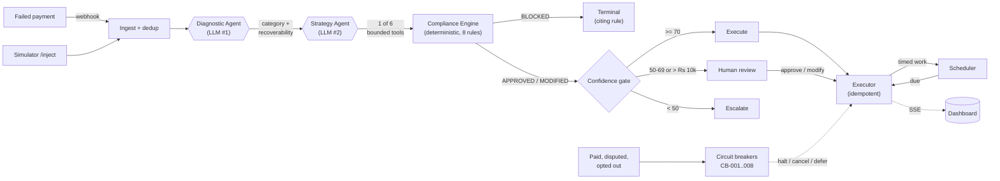

<div align="center">

# PayRecover

**Autonomous AI payment-recovery agent for Indian merchants.**

It detects failed Razorpay payments, diagnoses the root cause with an LLM, picks a bounded recovery
strategy — and then enforces every regulatory rule in **deterministic code, never a model**. Then it
actually executes: schedules retries, mints payment links, sends notifications, and halts itself the
instant a circuit breaker says stop.

*Built for the Razorpay AI Buildathon — Track 03: AI Revenue Recovery.*


**[Quick start](#quick-start) · [The core idea](#the-core-idea-compliance-is-code) ·
[How it works](#how-it-works) · [Architecture deep-dive](ARCHITECTURE.md)**

</div>

---

## Quick start

```bash
docker compose up --build
```

That boots PostgreSQL, the backend and the dashboard. Open **<http://localhost:3000>**.

**No API keys required.** Every external credential is optional. With none configured the whole stack
runs in simulation mode — mock Razorpay, deterministic agent fallback — so it is fully explorable out
of the box. Drop keys into `backend/.env` later to go live incrementally.

Click any preset button and watch the agent work. **🔄 Cascade Failure** is the one to try first.

<details>
<summary><b>Running locally without Docker</b></summary>

Requires Python 3.11+. PostgreSQL is optional — point at SQLite for a quick spin.

```bash
cd backend
python -m venv .venv
source .venv/bin/activate          # Windows: .\.venv\Scripts\Activate.ps1
pip install -r requirements.txt
cp .env.example .env               # optional; defaults work

# No Postgres handy? Use SQLite:
DATABASE_URL="sqlite+aiosqlite:///./payrecover.db" uvicorn app.main:app --reload --port 8000
```

> On Windows PowerShell, set the override with
> `$env:DATABASE_URL="sqlite+aiosqlite:///./payrecover.db"` before the `uvicorn` line.

Then the dashboard:

```bash
cd frontend
npm install
npm run dev                        # http://localhost:3000
```

- API root & health: <http://localhost:8000/> and <http://localhost:8000/health>
- Interactive API docs: <http://localhost:8000/docs>

</details>

---

## The problem

A meaningful share of Indian digital payments fail on the first attempt — insufficient funds, bank
downtime, expired cards, OTP drop-offs, gateway timeouts. Most of that revenue is recoverable.

Recovering it by hand is slow. Recovering it with a naive script is reckless: retry too often and you
breach NPCI's cap, message at the wrong hour and you breach TRAI, nudge a customer on the DND
registry and you breach that too.

---

## The core idea: compliance is code

Payment recovery is two problems wearing one coat.

**Judgement** — why did this fail, is it worth chasing, how should we chase it? Genuinely ambiguous,
context-dependent, and a great fit for a language model.

**Rules** — am I legally allowed to do this? NPCI caps retries at three per order. TRAI forbids
messaging outside 09:00–20:00. An active dispute freezes everything. These are not ambiguous. They
are `if` statements.

Most agent designs collapse both into one prompt and ask the model to be careful. PayRecover splits
them:

> ### LLMs propose. Deterministic code disposes.

Two LLM calls happen per event — diagnose, then choose a tool. After that the model is out of the
loop entirely. Compliance, confidence gating, execution, scheduling and circuit breaking are all pure
Python.

A model can *suggest* an action that violates NPCI. It cannot *perform* one, because the component
that performs actions never asks a model for permission.

What that buys:

- **A hallucinated `APPROVED` is structurally impossible.** The compliance engine has no model in it.
- **Every decision cites a `rule_id`** traceable to an actual regulation — `NPCI-001`, `TRAI-001`.
- **Identical decisions in mock and live mode**, which is why it runs with no API keys at all.
- **Even the confidence score is deterministic**, so a model cannot talk its way past human review by
  asserting it is 99% sure.

---

## How it works



**1 — Diagnostic Agent (LLM #1).** Takes the failure plus enriched context (customer history, issuer
status, IST clock) and returns a category (`soft` / `hard` / `terminal`), a root-cause analysis, and a
0–100 recoverability score.

**2 — Strategy Agent (LLM #2).** Selects **exactly one** of six bounded tools and parameterises it.
The action space is a fixed schema; the model cannot invent an action outside it.

**3 — Compliance Engine (deterministic).** Runs the proposal through eight rules and returns
`APPROVED`, `MODIFIED`, or `BLOCKED` with the citing rule. A blocked action terminates here — it
never reaches the gate.

**4 — Confidence gate.** Routes by confidence: high auto-executes, low pauses for a human. Any order
above ₹10,000 goes to a human regardless.

**5 — Executor.** Performs the action for real. Idempotent, and re-checked against the circuit
breakers immediately before firing, so work approved yesterday cannot go out on a payment that has
since been paid or disputed.

**6 — Scheduler + breakers.** Timed work fires on an APScheduler tick over a deterministic
`run_due_actions(now)` core. Meanwhile the breakers watch for reasons to stop mid-flight — the
customer paid, a dispute landed, they opted out — and cancel the pending queue.

> **One pipeline, two doors.** A real `payment.failed` webhook and a simulated `/inject` share one
> orchestration, so live traffic runs the same agents under the same gate. The simulator isn't a
> special case; it just invents the entity instead of parsing one. A Razorpay redelivery is ingested
> idempotently *and* never re-decided, so a retry can't mint a second payment link for one failure.

📐 **[Full architecture deep-dive →](ARCHITECTURE.md)** — module map, the timezone convention, the
data model, bugs worth recording, and what we'd do differently at scale.

---

## The bounded action space

The Strategy Agent must pick exactly one. This is the entire action space.

| Tool | When it's used | Cost |
| ---- | -------------- | ---- |
| `schedule_smart_retry` | Soft failures (timeout, bank downtime); never after 3 retries | Free |
| `generate_payment_link` | Hard failures needing customer action (insufficient funds, expired card) | Free |
| `send_recovery_notification` | A recovery nudge via email or SMS (max 1 / 24h / customer) | ~₹0.20 (SMS) |
| `offer_alternative_method` | One method keeps failing but alternatives exist (card → UPI) | Free |
| `escalate_to_merchant` | Terminal failures, edge cases, or where automation is inappropriate | Free |
| `mark_unrecoverable` | Terminal failures where no recovery is possible or advisable | Free |

Recovery is deliberately near-zero-cost — only an outbound SMS carries a real charge. That is what
makes the ROI story hold, and what the cost-ceiling rule polices.

---

## The 8 compliance rules

Enforced deterministically, in priority order. **The first rule to fire is the binding decision.**

| Rule ID | Name | Decision | What it enforces |
| ------- | ---- | -------- | ---------------- |
| `DISP-001` | Active Dispute | `BLOCKED` | An active dispute halts **all** recovery on that payment |
| `WINDOW-001` | Max Recovery Window | `BLOCKED` | No recovery after 14 days from failure |
| `COST-001` | Cost Ceiling | `BLOCKED` | Cumulative cost may not exceed 15% of order value |
| `NPCI-001` | NPCI Retry Cap | `BLOCKED` | Max 3 retries per order |
| `NPCI-002` | NPCI Peak Hours | `MODIFIED` | Retries shifted out of 10:00–13:00 and 17:00–21:30 IST |
| `DND-001` | DND Registry | `MODIFIED` | SMS to a DND-registered customer is switched to email |
| `TRAI-001` | TRAI Notification Hours | `MODIFIED` | Notifications only 09:00–20:00 IST; otherwise queued |
| `FREQ-001` | Notification Frequency Cap | `BLOCKED` | Max 1 notification per 24h per customer |

`MODIFIED` is the difference between a compliance engine and a validator. A validator says no. This
engine mostly says *"not like that, like this"* — recovery still happens, it happens legally.
Refusing outright would silently forfeit recoverable revenue.

All times are IST (`Asia/Kolkata`); all amounts are in paise.

---

## The confidence gate (human-in-the-loop)

| Confidence | Route | Who acts |
| ---------- | ----- | -------- |
| 85–100 | `auto_execute` | System, immediately |
| 70–84 | `auto_execute_flagged` | System, flagged for monitoring |
| 50–69 | `hitl_review` | Paused for a human |
| 0–49 | `escalate` | Handed to the merchant |

**High-value override:** any order above **₹10,000** is pinned to human review regardless of
confidence — never auto-executed, and never auto-escalated or closed either. It isn't
confident-therefore-safe; it's expensive-therefore-human.

A paused action waits in `GET /api/hitl/pending` carrying the whole reasoning chain, and resolves
three ways: `approve` executes as proposed, `modify` merges the merchant's edits and **re-runs
compliance**, `skip` closes the case.

`modify` is deliberately not a bypass. A `BLOCKED` verdict returns 409 with the citing rule, and
where the engine returns `MODIFIED` its correction **overrides the merchant's edit** — a human asking
to SMS a DND-registered customer still gets email.

> Humans can veto the agent. Neither can veto the regulator.

---

## The 8 circuit breakers

Compliance vets actions *before* they're proposed. Breakers halt work already **in flight**, because
the world moves between deciding and acting. They run on every state-changing webhook and again
pre-flight before anything fires.

| ID | Name | Trigger | Effect |
| -- | ---- | ------- | ------ |
| `CB-001` | Payment Recovered | The payment landed | Cancel all pending actions |
| `CB-002` | Dispute Raised | A dispute exists | Halt — legal process, not dunning |
| `CB-003` | Customer Opt-Out | The customer said stop | Halt communications |
| `CB-004` | Subscription Cancelled | Subscription cancelled | Halt |
| `CB-005` | NPCI Retry Cap | More than 3 attempts | Cancel pending **retries only** |
| `CB-006` | Max Recovery Window | More than 14 days since failure | Escalate + cancel |
| `CB-007` | Negative Economics | Cost above 15% of order value | Escalate + cancel |
| `CB-008` | TRAI Timing | Outside 09:00–20:00 IST | **Defer** notifications |

Two carry a deliberate design decision: **CB-005 cancels retries but leaves notifications alive**
(hitting the NPCI cap makes a case notification-only, it doesn't close it), and **CB-008 is a delay,
not a halt** — a nudge due at 21:00 is rescheduled for 09:00, because dropping it would forfeit
recoverable revenue.

The payoff is the scenario every merchant fears: a retry is scheduled, a reminder is queued, and the
customer pays through some other channel. `payment.captured` arrives, CB-001 trips, the queue is
cancelled — nobody gets chased for money they already paid.

---

## The dashboard

A dual-pane command center. The **left pane is a dark console** (the machine — controls, hero
metrics, presets, economics); the **right pane is a light ledger** (the record — agent trace, live
feed, journey timeline, audit drawer). The seam between them is the product's thesis: an autonomous
machine that produces an auditable record.

- **Agent trace** — every pipeline step as a coloured node (grey pending, blue running, green done,
  amber waiting on a human, red breaker-fired). Click any node for its chain of thought.
- **Compliance band** — a 24-hour IST strip with the TRAI window and NPCI peak hours shaded, every
  scheduled action plotted as a tick. When CB-008 defers a notification the tick animates to the edge
  of the legal window. The one thing PayRecover does that no other payments dashboard does is *reason
  about time*; this makes it watchable.
- **Chaos presets** — six one-click scenarios, loaded from the server so the buttons always match
  what it can actually run.
- **Economics + comparison** — ROI per failure channel from the live database, and a with-agent vs
  modelled-manual toggle.
- **HITL modal** — auto-opens when the gate needs a human, with the full reasoning chain.
- **Audit drawer** — the trail as a table, with CSV/JSON export.

Driven by a single SSE connection: one `EventSource`, one reducer, one store shape, so trace, feed
and metrics always move together. All the backend's shape variation is collapsed in
`lib/adapters.ts`, so components only ever see one clean type.

---

## See it work

<details>
<summary><b>The full curl walkthrough</b></summary>

```bash
# 1. Inject a synthetic failure. Diagnose + strategy + compliance + gate + execution
#    all run by default:
curl -X POST http://localhost:8000/api/simulator/inject \
  -H "Content-Type: application/json" \
  -d '{"failure_type": "bank_downtime", "amount": 250000}'
#    -> recovery.status = "approved", .executed = true
#       execution.result.retry_order_id = the retry the agent arranged

# 2. A big order is never auto-executed — it lands in the human queue:
curl -X POST http://localhost:8000/api/simulator/inject \
  -H "Content-Type: application/json" \
  -d '{"failure_type": "insufficient_funds", "amount": 1500000}'
curl http://localhost:8000/api/hitl/pending
curl -X POST http://localhost:8000/api/hitl/<action_id>/approve

# 3. Fast-forward the clock so scheduled work fires now instead of at 07:00:
curl -X POST http://localhost:8000/api/simulator/run-due-actions \
  -H "Content-Type: application/json" \
  -d '{"now": "2030-01-01T12:00:00+05:30"}'

# 4. The customer pays. CB-001 trips and cancels everything still pending:
curl -X POST http://localhost:8000/api/simulator/circuit-event \
  -H "Content-Type: application/json" \
  -d '{"event_type": "payment.captured", "order_id": "<order_sim_...>"}'
#    -> breakers_tripped: [{"breaker_id": "CB-001", ...}]

# 5. Read the reasoning chain back, or export it:
curl http://localhost:8000/api/audit/log
curl "http://localhost:8000/api/audit/export?format=csv" -o audit.csv

# 6. Or run steps 1-4 as one scenario. Same primitives, same gate — a preset cannot
#    reach past the compliance engine or produce an outcome /inject could not:
curl -X POST http://localhost:8000/api/simulator/chaos/hdfc_bank_crash
#    -> 5 injected, clock +12h, retries fire, 3 customers pay, CB-001 trips 3x

# 7. The one that shows the agent *adapting* rather than repeating — the retry fires,
#    fails with a DIFFERENT error, and the agent re-diagnoses soft->hard and pivots
#    from retrying to a payment link:
curl -X POST http://localhost:8000/api/simulator/chaos/cascade_failure

# 8. Then ask what it was worth:
curl http://localhost:8000/api/dashboard/economics          # ROI per failure channel
curl http://localhost:8000/api/dashboard/metrics/comparison # vs modelled manual recovery

# Watch the live stream (leave running, then inject in another terminal):
curl -N http://localhost:8000/api/stream
```

A **real webhook** drives the same pipeline and returns the same decision chain — no signature needed
locally until you set `RAZORPAY_WEBHOOK_SECRET`:

```bash
curl -X POST http://localhost:8000/webhooks/razorpay \
  -H "Content-Type: application/json" \
  -d '{"event": "payment.failed", "payload": {"payment": {"entity": {
        "id": "pay_demo_001", "order_id": "order_demo_001", "amount": 250000,
        "currency": "INR", "status": "failed", "method": "card",
        "email": "jane@example.com", "contact": "+919876543210",
        "error_source": "gateway", "error_step": "payment_authorization",
        "error_reason": "issuer_bank_down", "error_code": "GATEWAY_ERROR"}}}}'
#    -> pipeline.ran = true, recovery.tool = "schedule_smart_retry"
#       Send it twice: the second returns pipeline.reason = "duplicate_delivery"
```

With a `GROQ_API_KEY` set, `diagnosis_source` and `recovery.source` come back `"llm"`; with no key
they come back `"mock"` — same shape either way.

> Steps 1–2 use fixed failure types and amounts on purpose: they are the two injections whose routing
> is provably deterministic, so the demo behaves identically every time. A random inject draws a
> random synthetic customer, whose history moves the confidence score.

</details>

---

## Configuration

Copy `backend/.env.example` to `backend/.env`. **All keys are optional.**

| Variable | Purpose | If unset |
| -------- | ------- | -------- |
| `GROQ_API_KEY` | Groq LLM key (`gsk_…`) for the two agents | Agent layer uses the deterministic **mock brain** |
| `GROQ_MODEL` | Groq chat model | `openai/gpt-oss-120b` |
| `RAZORPAY_KEY_ID` | Razorpay API key id (`rzp_test_…`) | Razorpay calls are **simulated** |
| `RAZORPAY_KEY_SECRET` | Razorpay API key secret | Razorpay calls are **simulated** |
| `RAZORPAY_WEBHOOK_SECRET` | Verifies inbound webhook HMAC signatures | Signature check **skipped** (dev) |
| `DATABASE_URL` | Async DB URL | Local Postgres default |
| `CORS_ORIGINS` | Allowed origins (JSON array or comma-separated) | `http://localhost:3000` |
| `FORCE_SIMULATION` | Force simulation even if keys are present | `false` |

<details>
<summary><b>Getting the API keys</b></summary>

**Groq (`GROQ_API_KEY`)** — sign in at <https://console.groq.com>, open **API Keys → Create API Key**,
copy the `gsk_…` value into `backend/.env`.

The default model `openai/gpt-oss-120b` is on Groq's **free plan** (30 req/min, 1,000 req/day, 8K
tokens/min). The pipeline makes two LLM calls per event, so single injects and small batches run
live; large batches gracefully fall back to the mock when rate-limited. Switch models with
`GROQ_MODEL` — no code change.

**Razorpay test keys** — log in at <https://dashboard.razorpay.com>, toggle to **Test Mode**, then
**Account & Settings → API Keys → Generate Test Key**. Copy the Key Id (`rzp_test_…`) and Key Secret
(shown only once).

**Razorpay webhook secret** — in Test Mode: **Settings → Webhooks → Create New Webhook**. The URL is
your backend's public address ending in `/webhooks/razorpay`; for local dev expose it with a tunnel:

```bash
cloudflared tunnel --url http://localhost:8000
```

Enter any strong string as the secret and put that exact value in `RAZORPAY_WEBHOOK_SECRET`. Subscribe
to at least `payment.failed` and `payment.captured` (also useful: `order.paid`,
`payment.dispute.created`).

</details>

---

## API reference

<details>
<summary><b>All 27 endpoints</b></summary>

**Ingestion, streaming, metrics**

| Method | Path | Description |
| ------ | ---- | ----------- |
| GET | `/` | Service identity + Razorpay/Groq mode |
| GET | `/health` | The above plus `scheduler_running` and live SSE connection count |
| GET | `/api/stream` | SSE stream of live recovery activity |
| POST | `/webhooks/razorpay` | Webhook receiver (HMAC, dedup, agent pipeline, breakers, SSE) |
| GET | `/api/dashboard/metrics` | ₹ recovered, recovery rate, avg hours to recovery, breakdowns |
| GET | `/api/dashboard/economics` | ROI per failure channel, plus the zero-cost callout |
| GET | `/api/dashboard/metrics/comparison` | Agent vs modelled manual recovery at the 12% baseline |
| GET | `/api/dashboard/events` | Paginated recovery events (filter by `status`) |
| GET | `/api/dashboard/events/{id}` | One event + its actions + breaker events |

**Execution**

| Method | Path | Description |
| ------ | ---- | ----------- |
| GET | `/api/actions` | Actions, newest first (`event_id`, `status`, `limit`) |
| GET | `/api/actions/scheduled` | Queued work: retries awaiting their slot, CB-008 deferrals |
| GET | `/api/actions/{id}` | One action — decision, compliance verdict, outcome |
| POST | `/api/actions/{id}/execute` | Execute now. Idempotent; 409 on a blocked action unless `force` |

Optional body: `force` (execute despite `blocked`), `now` (clock override), `ignore_defer` (fire
outside the TRAI window). All default off — the safe path needs no body.

**Human-in-the-loop**

| Method | Path | Description |
| ------ | ---- | ----------- |
| GET | `/api/hitl/pending` | The review queue, with each item's reasoning |
| POST | `/api/hitl/{id}/approve` | Approve as proposed, then execute |
| POST | `/api/hitl/{id}/modify` | Edit parameters, re-run compliance, then execute |
| POST | `/api/hitl/{id}/skip` | Decline and close the case |

**Audit**

| Method | Path | Description |
| ------ | ---- | ----------- |
| GET | `/api/audit/log` | Full reasoning chain, filterable by event/agent/tool/status/verdict |
| GET | `/api/audit/breakers` | Every breaker that fired, and how many actions it cancelled |
| GET | `/api/audit/export` | `format=csv` (flat, 18 columns) or `json`. Returns the **whole** filtered chain by default |

**Simulator**

| Method | Path | Description |
| ------ | ---- | ----------- |
| POST | `/api/simulator/inject` | Inject 1–200 synthetic failures and run the full pipeline |
| POST | `/api/simulator/run-batch` | A weighted batch, returning the *aggregate* outcome |
| GET | `/api/simulator/presets` | The six chaos scenarios, as data |
| POST | `/api/simulator/chaos/{preset}` | Run one scenario end to end, with a step receipt |
| POST | `/api/simulator/run-due-actions` | Fire due scheduled work — the demo's fast-forward |
| POST | `/api/simulator/circuit-event` | Replay a state change to trip a breaker |
| GET | `/api/simulator/profiles` | List the available failure profiles |

`POST /api/simulator/inject` accepts an optional body:

```jsonc
{
  "failure_type": "insufficient_funds", // omit for a random weighted profile
  "amount": 1500000,                     // paise; omit for random
  "method": "card",                      // card | upi | netbanking | wallet
  "count": 1,                            // 1-200
  "diagnose": true,                      // run the Diagnostic Agent
  "recover": true,                       // run Strategy + Compliance + gate
  "execute": true                        // execute what the gate approved
}
```

`execute` only ever fires actions the gate *approved*. Anything routed to human review stays in the
queue however the flag is set — a demo switch must not be able to undo the gate.

</details>

<details>
<summary><b>SSE frames</b></summary>

`GET /api/stream` emits one frame per pipeline step, each with a `type`, so a client can render the
agent thinking rather than just its conclusion:

| Frame | Emitted when |
| ----- | ------------ |
| `connected` | Stream opened (then `: keep-alive` comments) |
| `failure_detected` / `failure_duplicate` | A failed payment arrived, or was deduped |
| `event_diagnosed` | Diagnostic Agent returned (with its `source`) |
| `strategy_selected` | Strategy Agent chose a tool, with confidence |
| `compliance_checked` | Compliance Engine's verdict + citing `rule_id` |
| `gate_decided` | Confidence gate routed the action |
| `action_executed` | The executor acted (a retry adds `retry_scheduled` too) |
| `action_deferred` / `action_failed` | Pushed out of the TRAI window, or errored |
| `retry_fired` | The scheduler fired due work |
| `circuit_event` / `circuit_breaker` | State changed; a breaker tripped |
| `hitl_resolved` | A human approved, modified, or skipped |

</details>

---

## The audit trail

Because compliance and confidence are deterministic, every decision can be **replayed** rather than
merely logged. `GET /api/audit/log` returns the full chain per event — the diagnosis and its source
(`llm` or `mock`), the tool chosen and why, the confidence with its risk and uncertainty factors, the
compliance verdict with the exact `rule_id`, the gate's routing, any human's decision, and the
execution outcome. Filterable by event, agent, tool, status, or compliance decision, and exportable
as flat CSV or nested JSON.

Given the same inputs, you get the same verdict — forever. That is what makes it an audit trail
rather than a log.

---

## Testing

```bash
cd backend
pip install -r requirements.txt
pytest                            # 142 tests, throwaway SQLite, no keys needed
```

**142 tests, all passing, fully offline.** Coverage spans HMAC verification, ingestion and idempotent
dedup, the webhook's handoff into the pipeline (including that a redelivery is never re-decided), the
diagnostic classifier, the strategy planner, all 8 compliance rules, every gate tier plus the
high-value override, the executor's per-tool outcomes and idempotency, all 8 circuit breakers, the
scheduler against an explicit clock, the TRAI deferral, all three HITL resolutions, the audit log and
export, the economics arithmetic, and all six chaos presets including the cascade journey.

Two tests exist purely to protect the others. Because synthetic customer history is derived from a
hash of identity, a randomly injected failure can legitimately land in different confidence bands —
which would make any routing assertion intermittently flaky.
`test_bank_downtime_injection_always_auto_approves_a_retry` and
`test_high_value_injection_always_needs_a_human` sweep all 64 possible histories across a spread of
hours and days, so retuning a confidence weight fails loudly instead of making the suite quietly
unreliable.

> The [architecture doc](ARCHITECTURE.md#testing-strategy) covers the testing techniques that were
> worth more than the count — including deliberately sabotaging the code to find a coverage gap that
> 15 passing tests had missed.

---

## Tech stack

| Layer | Choice |
| ----- | ------ |
| Backend | FastAPI (Python 3.11+), fully async |
| Database | PostgreSQL 16 via SQLAlchemy 2 (async) + asyncpg; SQLite for local/tests |
| Real-time | Server-Sent Events |
| LLM | Groq — `openai/gpt-oss-120b` (free tier), direct SDK, no LangChain |
| Payments | Official `razorpay` SDK (test mode), key-optional |
| Scheduling | APScheduler, in-process and optional — a missing install degrades to manual firing |
| Frontend | Next.js 15 + React 19 + Tailwind 4, SSE-driven |
| Deploy | Docker Compose |

<details>
<summary><b>Project structure</b></summary>

```
razorpay/
├── backend/
│   ├── app/
│   │   ├── main.py               # FastAPI app: CORS, lifespan, SSE, 6 routers
│   │   ├── config.py             # settings (all keys optional)
│   │   ├── database.py           # async engine + session (Postgres / SQLite)
│   │   ├── models.py             # ORM: events, actions, circuit_breaker_events
│   │   ├── ingest.py             # shared ingestion + serialization
│   │   ├── pipeline.py           # the agent pipeline, shared by webhook + simulator
│   │   ├── sse.py                # Server-Sent Events manager
│   │   ├── timeutil.py           # the IST/UTC boundary, decided in one place
│   │   ├── analytics.py          # ROI + comparison, as pure functions
│   │   ├── chaos.py              # the 6 demo presets, as declarative data
│   │   ├── diagnosis/            # classifier.py + enricher.py
│   │   ├── strategy/             # planner.py (deterministic strategy brain)
│   │   ├── compliance/           # engine.py (the 8 rules)
│   │   ├── agent/                # the 2 orchestrators, 6 tools, confidence, prompts
│   │   ├── execution/            # executor, circuit_breakers, scheduler, statuses
│   │   ├── llm/client.py         # key-optional Groq wrapper (mock fallback)
│   │   ├── razorpay/client.py    # key-optional Razorpay wrapper
│   │   ├── webhooks/             # signature.py (HMAC) + router.py
│   │   └── api/                  # dashboard, simulator, action, hitl, audit routes
│   └── tests/                    # 142 tests (SQLite)
├── frontend/
│   └── src/
│       ├── app/                  # page.tsx, layout.tsx, globals.css
│       ├── components/           # AgentTrace, ComplianceBand, HITLModal, …
│       ├── lib/                  # types, adapters, api, store, states, format
│       └── hooks/useSSE.ts       # the single SSE connection
├── docker-compose.yml
├── ARCHITECTURE.md
└── README.md
```

</details>

---

## Documentation

| Doc | What's in it |
| --- | ------------ |
| **README** (this file) | What it does, how to run it, the rules and tools |
| **[ARCHITECTURE.md](ARCHITECTURE.md)** | Module map, design decisions, the timezone convention, data model, bugs worth recording, scale limits |

---

## Roadmap

**Done — the full autonomous loop**

- FastAPI foundation, key-optional config, async DB + 3-table schema
- Webhook receiver: HMAC verification, dedup, circuit-event handling
- **Diagnostic Agent** (LLM #1) and **Strategy Agent** (LLM #2) over 6 bounded tools
- **Compliance Engine**: 8 deterministic NPCI / TRAI / DND / dispute / cost rules
- **Confidence gate + HITL** with the high-value override and compliance re-check on modify
- **Execution engine**: idempotent executor, payment links, retry orders, notifications
- **Circuit breakers** CB-001..008, run on webhooks and again pre-flight
- **Scheduler**: APScheduler over a deterministic due-action core, with on-demand fast-forward
- **Audit trail**: full reasoning chain, breaker log, untruncated CSV + JSON export
- **Live Groq integration** on the free tier, with a deterministic mock fallback
- **One pipeline, two doors**: webhooks and `/inject` share one orchestration under one gate
- **Recovery economics**: ROI per channel and a modelled-manual comparison, from live data
- **Chaos presets**: 6 one-click scenarios including cascade mode, plus a weighted batch runner
- **The dashboard**: dual-pane SSE command center with the IST compliance band
- Docker Compose across all three services; 142-test suite

**Next**

- **Merchant-level controls**: pause recovery per merchant, per-merchant cost ceilings

---

<div align="center">

**[Quick start](#quick-start) · [Architecture](ARCHITECTURE.md)**

</div>
